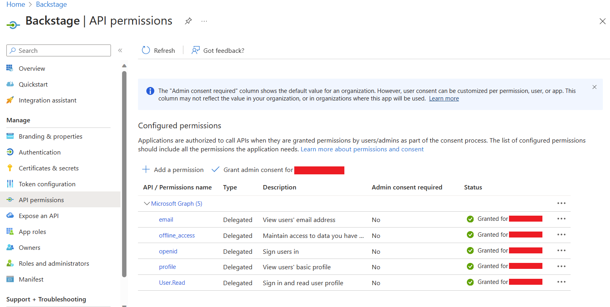

The Backstage `core-plugin-api` package comes with a Microsoft authentication
provider that can authenticate users using Azure OAuth.

## Configure App Registration on Azure

Depending on how locked down your company is, you may need a directory administrator to do some or all of these instructions.

Go to [Azure Portal > App registrations](https://portal.azure.com/#view/Microsoft_AAD_RegisteredApps/ApplicationsListBlade) and find your existing app registration, or create a new one.
If you have an existing App Registration for Backstage, use that rather than create a new one.

On your app registration's overview page, add a new `Web` platform configuration, with the configuration:

- **Redirect URI**: `https://your-backstage.com/api/auth/microsoft/handler/frame` (for local dev, typically `http://localhost:7007/api/auth/microsoft/handler/frame`)
- **Front-channel logout Url**: blank
- **Implicit grant and hybrid flows**: All unchecked

On the **API permissions** tab, click on `Add Permission`, then add the following `Delegated` permission for the `Microsoft Graph` API.

- `email`
- `offline_access`
- `openid`
- `profile`
- `User.Read`
- Optional custom scopes of the `Microsoft Graph` API defined in the app-config.yaml file.

Your company may require you to grant [admin consent](https://learn.microsoft.com/en-us/azure/active-directory/manage-apps/user-admin-consent-overview) for these permissions.
Even if your company doesn't require admin consent, you may wish to do so as it means users don't need to individually consent the first time they access backstage.
To grant admin consent, a directory admin will need to come to this page and click on the **Grant admin consent for COMPANY NAME** button.



If you're using an existing app registration, and backstage already has a client secret, you can re-use that.
If not, go to the **Certificates & Secrets** page, then the **Client secrets** tab and create a new client secret.
Make a note of this value as you'll need it in the next section.

## Configuration

The provider configuration can then be added to your `app-config.yaml` under the
root `auth` configuration:

```yaml
auth:
  environment: development
  providers:
    microsoft:
      development:
        clientId: ${AZURE_CLIENT_ID}
        clientSecret: ${AZURE_CLIENT_SECRET}
        tenantId: ${AZURE_TENANT_ID}
        domainHint: ${AZURE_TENANT_ID}
        additionalScopes:
          - Mail.Send
        signIn:
          resolvers:
            # typically you would pick one of these
            - resolver: emailMatchingUserEntityProfileEmail
            - resolver: emailLocalPartMatchingUserEntityName
            - resolver: emailMatchingUserEntityAnnotation
```

The Microsoft provider is a structure with three mandatory configuration keys:

- `clientId`: Application (client) ID, found on App Registration > Overview
- `clientSecret`: Secret, found on App Registration > Certificates & secrets
- `tenantId`: Directory (tenant) ID, found on App Registration > Overview
- `domainHint` (optional): Typically the same as `tenantId`.
  Leave blank if your app registration is multi tenant.
  When specified, this reduces login friction for users with accounts in multiple tenants by automatically filtering away accounts from other tenants.
  For more details, see [Home Realm Discovery](https://learn.microsoft.com/en-us/azure/active-directory/manage-apps/home-realm-discovery-policy)
- `additionalScopes` (optional): List of scopes for the App Registration. The default and mandatory value is ['user.read'].

### Resolvers

This provider includes several resolvers out of the box that you can use:

- `emailMatchingUserEntityProfileEmail`: Matches the email address from the auth provider with the User entity that has a matching `spec.profile.email`. If no match is found it will throw a `NotFoundError`.
- `emailLocalPartMatchingUserEntityName`: Matches the [local part](https://en.wikipedia.org/wiki/Email_address#Local-part) of the email address from the auth provider with the User entity that has a matching `name`. If no match is found it will throw a `NotFoundError`.
- `emailMatchingUserEntityAnnotation`: Matches the email address from the auth provider with the User entity where the value of the `microsoft.com/email` annotation matches. If no match is found it will throw a `NotFoundError`.

:::note Note

The resolvers will be tried in order, but will only be skipped if they throw a `NotFoundError`.

:::

If these resolvers do not fit your needs you can build a custom resolver, this is covered in the [Building Custom Resolvers](../identity-resolver.md#building-custom-resolvers) section of the Sign-in Identities and Resolvers documentation.

## Adding the provider to the Backstage frontend

To add the provider to the frontend, add the `microsoftAuthApiRef` reference and
`SignInPage` component as shown in
[Adding the provider to the sign-in page](../index.md#adding-the-provider-to-the-sign-in-page).

## Outbound Network Access

If your environment has restrictions on outgoing access (e.g. through
firewall rules), make sure your Backstage backend has access to the following
hosts:

- `login.microsoftonline.com`, to get and exchange authorization codes and access
  tokens
- `graph.microsoft.com`, to fetch user profile information (as seen
  in [this source code](https://github.com/seanfisher/passport-microsoft/blob/0456aa9bce05579c18e77f51330176eb26373658/lib/strategy.js#L93-L95)).
  If this host is unreachable, users may see an `Authentication failed, failed to fetch user profile` error when they attempt to log in.
