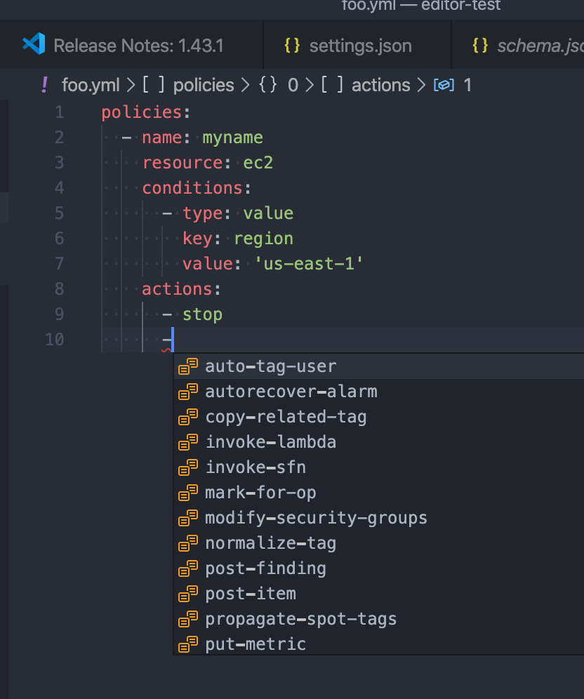

.. _quickstart:

Getting Started
===============

Also see the README in the `GitHub repository <https://github.com/cloud-custodian/cloud-custodian>`_.

* :ref:`install-cc`
* :ref:`explore-cc`
* :ref:`cloud-providers`
* :ref:`monitor-cc`
* :ref:`tab-completion`
* :ref:`pre-commit`
* :ref:`community`

.. _install-cc:

Install Cloud Custodian
-----------------------

These instructions will install Cloud Custodian. Cloud Custodian is a Python
application that supports Python 3 on Linux, MacOS and Windows. We recommend
using at least the minimum supported version of Python.

If ``python3 --version`` shows a Python version that is not `actively
supported <https://devguide.python.org/#status-of-python-branches>`_ and the
steps above don't apply to your environment, you can still install a current
release of Python manually. `This guide
<https://realpython.com/installing-python/>`_ may be a useful reference.

NOTE: Some Enterprise/Long Term Support Linux distributions may support Python
longer than the upstream support period. If you are in this situation it might
be prudent to contact your vendor to see if there are other supported ways to
use a more recent version. In some cases using the Docker container might be
an appropriate solution.

NOTE: Ensure you install the correct follow-on package depending on the cloud
you are deploying to, otherwise you won't have the right modules for that
specific cloud.

Linux and Mac OS
+++++++++++++++++++++++++++

To install Cloud Custodian::

  python3 -m venv custodian
  source custodian/bin/activate
  pip install c7n       # This includes AWS support

To install Cloud Custodian for Azure, you will also need to run::

  pip install c7n-azure # Install Azure package

To install Cloud Custodian for GCP, you will also need to run::

  pip install c7n-gcp   # Install GCP Package

To install Cloud Custodian for Oracle Cloud Infrastructure (OCI), you will also need to run::

    pip install c7n-oci # Install OCI Package

Windows (CMD/PowerShell)
+++++++++++++++++++++++++++

To install Cloud Custodian, run::

  python3 -m venv custodian
  .\custodian\Scripts\Activate.ps1   # For Powershell users
  # .\custodian\Scripts\activate.bat # Or use this for CMD users
  pip install c7n    # This includes AWS support

To install Cloud Custodian for Azure, you will also need to run::

  pip install c7n-azure

To install Cloud Custodian for GCP, you will also need to run::

  pip install c7n-gcp

Docker
++++++

To install via Docker, run::

  docker pull cloudcustodian/c7n

You'll need to export your cloud provider credentials to the container
when executing. For example, if you're using environment variables for provider
credentials::

  docker run -it \
    -v $(pwd)/output:/home/custodian/output \
    -v $(pwd)/policy.yml:/home/custodian/policy.yml \
    --env-file <(env | grep "^AWS\|^AZURE\|^GOOGLE") \
       cloudcustodian/c7n run -v -s /home/custodian/output /home/custodian/policy.yml

.. _explore-cc:

Explore Cloud Custodian
-----------------------

Run ``custodian -h`` to see a list of available commands.

Run ``custodian schema`` to see the complete list of cloud resources against
which you can run policies. To invoke command-line help with more information
about policy schema details, run ``custodian schema -h``.

Run ``custodian schema <cloud-provider>`` to see the available resources for a
specific cloud provider: ``custodian schema aws``

Run ``custodian schema <cloud-provider>.<resource>`` to see the available
filters and actions for each resource.

Drill down to get more information about available policy settings for each
resource, where the model for the command is::

  custodian schema <cloud>.<resource>.<category>.<item>

For example::

  custodian schema aws.s3.filters.is-log-target

provides the following information::

  Help
  ----

  Filter and return buckets are log destinations.

  Not suitable for use in lambda on large accounts, This is a api
  heavy process to detect scan all possible log sources.

  Sources:
    - elb (Access Log)
    - s3 (Access Log)
    - cfn (Template writes)
    - cloudtrail

  :example:

      .. code-block: yaml

          policies:
            - name: s3-log-bucket
              resource: s3
              filters:
                - type: is-log-target

  Schema
  ------

  {   'additionalProperties': False,
      'properties': {   'type': {   'enum': ['is-log-target']},
                        'value': {   'type': 'boolean'}},
      'required': ['type'],
      'type': 'object'}

Additionally, you can use the schema command to view information on the different
supported modes in Cloud Custodian::

  custodian schema mode

.. _cloud-providers:

Cloud Provider Specific Help
----------------------------

For specific setup isntructions for AWS, Azure, and GCP, visit the relevant getting started
page.

- :ref:`AWS <aws-gettingstarted>`
- :ref:`Azure <azure_gettingstarted>`
- :ref:`GCP <gcp_gettingstarted>`

Troubleshooting & Tinkering
+++++++++++++++++++++++++++

The policy is validated automatically when you run it, but you can also
validate it separately:

.. code-block:: bash

  custodian validate custodian.yml

You can also check which resources are identified by the policy without
running any actions on the resources:

.. code-block:: bash

  custodian run --dryrun -s . custodian.yml

.. _monitor-cc:

Monitor resources
-----------------

Additional commands let you monitor your services in detail.

You can generate metrics, log outputs, and output to blob storage in each of the different
providers (AWS, Azure, Google Cloud Platform).

For detailed instructions on how to add metrics, logging, and blob storage output for the
different clouds, check out the cloud provider specific pages:

- :ref:`AWS <aws-gettingstarted>`
- :ref:`Azure <azure_gettingstarted>`
- :ref:`GCP <gcp_gettingstarted>`

For details, see :ref:`usage`.

.. _editor-integration:

Editor Integration
------------------

If your preferred editor supports language servers, you can configure
it to provide completion and validation while authoring policies.

First generate use custodian to generate a json schema file::

  custodian schema --json > schema.json

Next install a YAML plug-in for your editor, like `YAML for Visual Studio Code
<https://marketplace.visualstudio.com/items?itemName=redhat.vscode-yaml>`_ or
`coc-yaml for coc.nvim <https://github.com/neoclide/coc-yaml>`_. Both plug-ins
use the `yaml-language-server
<https://github.com/redhat-developer/yaml-language-server>`_ under the hood.

You'll then need to configure your plug-in to use the generated `schema.json`
as the schema for your policy files. For example in Visual Studio Code,
navigate to the settings for the YAML plug-in and under Schemas, edit
configuration file and add the following schema configuration::

      "yaml.schemas": {
        "./schema.json": "*yml"
      },

Note the path to schema.json can either be either relative or the full path.

You'll now have completion and validation while authoring policies.

Note if you're authoring policies in json you can also configure the
json-language-server for the same.

Also, if you're seeing errors like ``'Request textDocument/hover failed with
message: Cannot read property '$ref' of null'`` try re-creating your
schema.json file.

.. _tab-completion:

Tab Completion
--------------

To enable command-line tab completion for `custodian` on bash do the following
one-time steps:

Run:

.. code-block:: bash

    activate-global-python-argcomplete

Now launch a new shell (or refresh your bash environment by sourcing the appropriate
file).

.. _pre-commit:

Pre-commit Integration
----------------------

A hook used to validate Cloud Custodian policies before committing them, to reduce issues when developing.

Reference the hook in your `.pre-commit-config.yaml` file:

.. code-block:: yaml

  repos:
    - repo: https://github.com/cloud-custodian/cloud-custodian.git
      rev: main # or use a specific release
      hooks:
        - id: c7n-validate
          files: policies/.*\.yml$
          args:
            # - --strict
            - --quiet

.. _community:

Community Resources
-------------------

We have a regular community meeting that is open to all users and developers of
every skill level. Joining the `mailing list
<https://groups.google.com/forum/#!forum/cloud-custodian>`_ will automatically send
you a meeting invite. See the notes below for more technical information on
joining the meeting.

 * `Community Meeting Videos <https://www.youtube.com/watch?v=qy250y0UT-4&list=PLJ2Un8H_N5uBeAAWK95SnWvm_AuNJ8q2x>`_
 * `Community Meeting Notes Archive <https://github.com/cloud-custodian/community/discussions>`_

Troubleshooting
+++++++++++++++

If you get an error about "complete -D" not being supported, you need to update bash.
See the "Base Version Compatability" note `in the argcomplete docs
<https://argcomplete.readthedocs.io/en/latest/#global-completion>`_:

If you have other errors, or for tcsh support, see `the argcomplete docs
<https://argcomplete.readthedocs.io/en/latest/#activating-global-completion>`_.

If you are invoking `custodian` via the `python` executable tab completion will not work.
You must invoke `custodian` directly.

