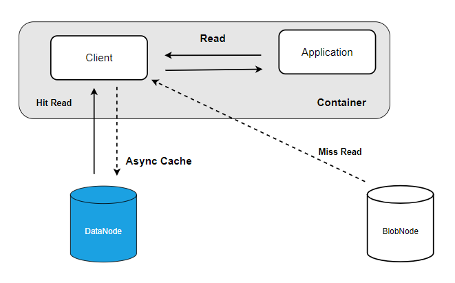
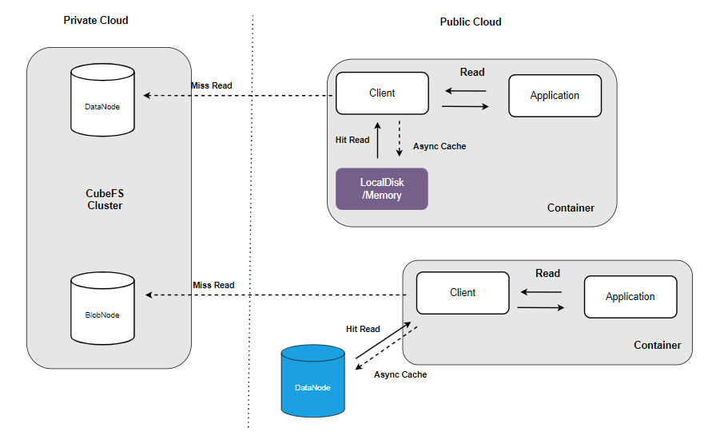

# 缓存加速
如果是类似 AI 模型训练的应用场景，若需对同一批数据反复读取来迭代模型，则推荐使用 CubeFS 缓存加速机制来大幅度降低读写时延，提高吞吐。

## 本地缓存-磁盘版
利用计算节点的本地磁盘作为数据块缓存，在对数据的读取效率具有显著的提高。

客户端的读请求会优先访问本地磁盘的数据缓存区，如果缓存命中，则直接从本地磁盘获得所需数据，否则从后端的多副本子系统或者纠删码子系统中读取数据，再异步将缓存数据写入本地磁盘，提升后续请求的访问性能。


要开启本地磁盘缓存功能，需要先启动本地 cache 服务：

``` bash
./cfs-bcache -c bcache.json
```

配置文件中各参数的含义如下表所示：

| 参数           | 类型           | 含义                                   | 必需  |
|--------------|--------------|--------------------------------------|-----|
| cacheDir         | string       | 缓存数据的本地存储路径:分配空间（单位Byte)| 是   |
| logDir       | string       | 日志路径| 是   |
| logLevel      | string slice | 日志级别| 是   |

然后客户端的配置项需要增加 bcacheDir 即可：
``` bash
{
  ...
  "bcacheDir": "path/to/data"  //需要缓存到本地的数据目录
}
```

### 缓存一致性

CubeFS 通过以下几种策略来保证本地缓存的最终一致性：

+ 根据文件名后缀来禁用缓存：例如训练任务生成的 checkpoint 文件在任务执行过程中会被反复更新，因此不适合进行本地缓存。可以在客户端的配置文件中的 bcacheFilterFiles 增加 "pt" 对这类文件禁用缓存。
``` bash
{
  ...
   "bcacheFilterFiles": "pt"  //禁止对.pt后缀的文件进行缓存
}
```
+ 定期检查：客户端会定期向后端查询缓存数据的对应的元数据是否有变更，如果有变更则删除本地缓存数据。
+ 主动失效：单个挂载点的场景，用户更新数据后会删除本地缓存数据；而多个挂载点场景中，其他挂载点只能等待缓存数据生命周期到期后失效。

## 本地缓存-内存版
如果数据量少，且希望进一步提高缓存性能，可使用计算节点的内存资源作为本地缓存。


/dev/shm 是 Linux 的内存文件系统，支持动态调整其容量大小。这里将 /dev/shm 调整至 15G，表示最多可以使用 15G 内存来缓存数据。
``` bash
# sudo mount -o size=15360M -o remount /dev/shm
```
然后将 bcache 服务的配置文件改为 /dev/shm 的子目录即可，例如：
``` bash
{
  ...
  "cacheDir":"/dev/shm/cubefs-cache:16106127360" //使用15G内存作为数据缓存
}
```

## 分布式缓存
客户端本地缓存是由该节点独享，当大量不同客户端需反复读取同一批数据集时，可将数据缓存到副本子系统中（分布式缓存），假设训练数据存储在成本更低的纠删码子系统中，可通过开启预读，将数据提前缓存到副本子系统，从而获取更高的缓存效率。



客户端会优先从副本子系统中读取数据，如果成功命中则直接从副本子系统中读取所需数据；否则从纠删码子系统中读取数据，同时异步缓存至副本子系统保证后续的访问性能。
> 如果客户端同时开启了本地缓存，则会根据本地缓存、副本子系统、纠删码子系统的顺序，依次尝试读取数据。同时在没有命中的情况下，将数据异步缓存至各级缓存保证后续的访问性能。

要使用分布式缓存进行提速，可以在创建纠删码卷时或者通过卷管理的更新接口设置 cacheCap 和 cacheAction 属性，来配置分布式缓存的容量以及开启客户端的缓存读功能，比如通过如下命令给低频卷配置 100GB 的分布式缓存，同时客户端从纠删码子系统读取数据时，会异步将数据缓存至分布式缓存。
``` bash
curl -v "http://127.0.0.1:17010/vol/update?name=test&cacheCap=100&cacheAction=1&authKey=md5(owner)"
```

## 混合云云上节点做缓存

在混合云 ML 场景，为保证数据安全性和一致性，通常会将训练数据保存在私有云，公有云上的计算节点通过专线或公网访问私有云上数据，这种跨云数据读写方式会导致较高的读写延时，较大的带宽开销，同时训练耗时更长会导致算力资源浪费。可通过 CubeFS 的本地缓存及分布式缓存机制，将训练数据缓存到公有云节点，减少数据的跨云数据传输，从而提升训练迭代效率。


如果训练任务的数据集存储路径固定，可通过预热的方式，将训练数据提前加载到多副本子系统。


``` bash
./cfs-preload -c config.json
```
配置文件中各参数的含义如下表所示：

| 参数           | 类型           | 含义                                   | 必需  |
|--------------|--------------|--------------------------------------|-----|
| volumeName         | string       | 预热数据所在卷| 是   |
| masterAddr      | string  | 预热数据所在集群的master地址| 是   |
| target       | string       | 预热数据在卷中的存储路径                              | 是   |
| logDir     | string       | 日志存储目录                  | 是   |
| logLevel   | string  | 日志等级| 是   |
| ttl | string       | 预热数据的生存周期，单位秒                   | 是   |
| action         | string       | 预热操作: "preload"执行预热操作;"clear"执行预热数据清理                          | 是   |
| action         | string       | 遍历预热数据目录的最大并发数                          | 否   |
| action         | string       | 预热数据文件大小的最大值，低于该值的文件不会被预热                          | 否   |
| action         | string       | 预热数据文件的最大并发数                          | 否   |

同时，计算节点可开启本地缓存，将副本子系统中的已预热的数据再缓存到本地磁盘/内存，以进一步提高数据的访问效率。

