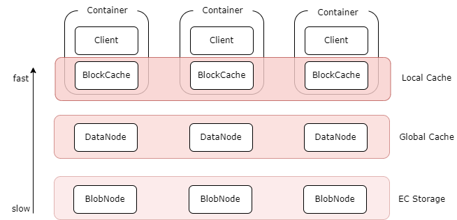

# 简介 

## 什么是CubeFS ？

CubeFS是新一代云原生存储产品，目前是[云原生计算基金会](https://www.cncf.io/projects/cubefs/)（CNCF）托管的孵化阶段开源项目， 兼容S3、POSIX、HDFS等多种访问协议，支持多副本与纠删码两种存储引擎，为用户提供多租户、
多AZ部署以及跨区域复制等多种特性，广泛应用于大数据、AI、容器平台、数据库、中间件存算分离、数据共享以及数据保护等场景。

<video width="100%" height="300" controls>
    <source src="https://ocs-cn-north1.heytapcs.com/cubefs/website-file/cubefsintro.mp4" type="video/mp4">
</video>

## 为什么选择CubeFS ？

### 多协议

兼容S3、POSIX、HDFS等多种访问协议，协议间访问可互通

- **POSIX兼容**：兼容POSIX接口，让上层应用的开发变得极其简单，就跟使用本地文件系统一样便捷。此外，CubeFS在实现时放松了对POSIX语义的一致性要求来兼顾文件和元文件操作的性能。
- **对象存储兼容**：兼容AWS的S3对象存储协议，用户可以使用原生的Amazon S3 SDK管理CubeFS中的资源。
- **Hadoop协议兼容**：兼容Hadoop FileSystem接口协议，用户可以使用CubeFS来替换Hadoop 文件系统（ HDFS ），做到上层业务无感。

### 双引擎

支持多副本及纠删码两种引擎，用户可以根据业务场景灵活选择

- **多副本存储引擎**：副本之间的数据为镜像关系，通过强一致的复制协议来保证副本之间的数据一致性，用户可以根据应用场景灵活的配置不同副本数。
- **纠删码存储引擎**：纠删码引擎具备高可靠、高可用、低成本、支持超大规模(EB)的特性，根据不同AZ模型可以灵活选择纠删码模式。

### 多租户

支持多租户管理，提供细粒度的租户隔离策略

### 可扩展

可以轻松构建PB或者EB级规模的分布式存储服务，各模块可水平扩展

### 高性能

支持多级缓存，针对小文件特定优化，支持多种高性能的复制协议

- **元数据管理**：元数据集群为内存元数据存储，在设计上使用两个B-Tree（inodeBTree与dentryBTree）来管理索引，进而提升元数据访问性能；
- **强一致副本协议**
  ：CubeFS根据文件写入方式的不同采用不同的复制协议来保证副本间的数据一致性。（如果文件按照顺序写入，则会使用主备复制协议来优化IO吞吐量；如果是随机写入覆盖现有文件内容时，则是采用一种基于Multi-Raft的复制协议，来确保数据的强一致性）；
- **多级缓存**：纠删码卷支持多级缓存加速能力，针对热点数据，提供更高数据访问性能：
    - 本地缓存：可以在Client机器上同机部署BlockCache组件，将本地磁盘作为本地缓存. 可以不经过网络直接读取本地Cache, 但容量受本地磁盘限制；
    - 全局缓存：使用副本组件DataNode搭建的分布式全局Cache, 比如可以通过部署客户端同机房的SSD磁盘的DataNode作为全局cache, 相对于本地cache, 需要经过网络, 但是容量更大, 可动态扩缩容,副本数可调。

### 云原生

基于[CSI插件](../user-guide/k8s.md)可以快速地在Kubernetes上使用CubeFS

## 应用场景

CubeFS作为一个云原生的分布式存储平台，提供了多种访问协议，因此其应用场景也非常广泛，下面简单介绍几种比较典型的应用场景

### 大数据分析

兼容HDFS协议，为Hadoop生态（如Spark、Hive）提供统一存储底座，为计算引擎提供无限的存储空间以及大带宽的数据存储能力。

### 深度训练/机器学习

作为分布式并行文件系统，支撑AI训练、模型存储及分发、IO加速等需求。

### 容器共享存储

容器集群可以将容器镜像的配置文件或初始化加载数据存储在CubeFS上，在容器批量加载时实时读取。多POD间通过CubeFS共享持久化数据，在POD故障时可以进行快速故障切换。

### 数据库&中间件

为数据库应用如MySQL、ElasticSearch、ClickHouse提供高并发、低时延云盘服务，实现彻底的存算分离。

### 在线服务

为在线业务(如广告、点击流、搜索)或终端用户的图、文、音视频等内容提供高可靠、低成本的对象存储服务。

### 传统NAS上云

替换线下传统本地存储及NAS，助力IT业务上云。
