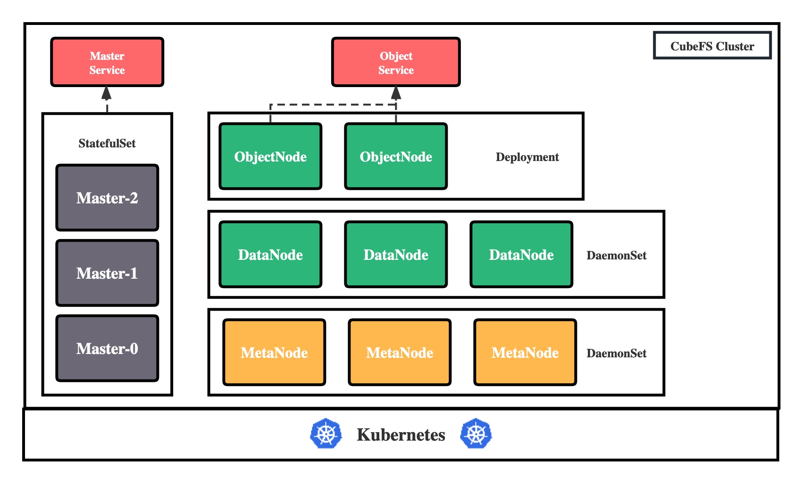

# Kubernetes Deployment

CubeFS can be deployed in a Kubernetes cluster using the helm tool, and each component will directly use the host network. The disk is mapped to the container using hostPath.

## Deployment Architecture



CubeFS currently consists of these four parts:

`Master`: Resource management node, responsible for maintaining the metadata of the entire cluster, deployed as a StatefulSet resource.

`DataNode`: Data storage node, which needs to mount a large number of disks to be responsible for the actual storage of file data, deployed as a DaemonSet resource.

`MetaNode`: Metadata node, responsible for storing all file metadata, deployed as a DaemonSet resource.

`ObjectNode`: Responsible for providing the ability to provide object storage by converting the S3 protocol, a stateless service, deployed as a Deployment resource.

## Machine Preparation

Before starting the deployment, you need to have a Kubernetes cluster with at least 3 nodes (preferably 4 or more, for disaster tolerance) and a version greater than or equal to 1.15.

Then start planning the machine, label the machine with its own label, indicating the role that this machine will play in the CubeFS cluster:

``` bash
# Master node, at least three, it is recommended to have an odd number
kubectl label node <nodename> component.cubefs.io/master=enabled
# MetaNode metadata node, at least 3, odd or even
kubectl label node <nodename> component.cubefs.io/metanode=enabled
# Dataode data node, at least 3, odd or even
kubectl label node <nodename> component.cubefs.io/datanode=enabled
# ObjectNode object storage node, can be marked as needed, if you don't need object storage function, you can also not deploy this component
kubectl label node <nodename> component.cubefs.io/objectnode=enabled
```

CubeFS installation will match these labels through `nodeSelector` and then create corresponding `Pods` on the machine.

## Mount Data Disk

Perform the operation of mounting the data disk on the node marked as `component.cubefs.io/datanode=enabled`.

### View machine disk information

``` bash
fdisk -l
```

### Format the disk

``` bash
mkfs.xfs -f /dev/sdx
```

### Create a mount directory

``` bash
mkdir /data0
```

### Mount the disk

``` bash
mount /dev/sdx /data0
```

If there are multiple data disks that need to be mounted on the machine, format and mount each disk according to the above steps, and name the mount directory in the order of `data0/data1/../data999`.

## Install helm

Install helm, refer to [official documentation](https://helm.sh/docs/intro/install/)

## Get CubeFS Helm repository

``` bash
git clone https://github.com/cubefs/cubefs-helm.git
cd cubefs-helm
```

## Edit the Configuration

The deployment of CubeFS helm has a large number of configurations, and all configurable items are located in `cubefs/values.yaml` under the helm project, which includes detailed comments.

Here, a separate configuration file `cubefs-helm.yaml` is created to cover the key configuration items.

``` bash
touch cubefs-helm.yaml
```

The contents of the `cubefs-helm.yaml` file are as follows:

``` yaml
# Which components to install, if only the server is installed, keep the following configuration. If the client needs to be installed, set csi to true
component:
  master: true
  datanode: true
  metanode: true
  objectnode: true
  client: false
  csi: false
  monitor: false
  ingress: true

# path.data: The metadata storage path of Master and MetaNode will be stored on the host in the form of hostPath. It is recommended to use a high-performance underlying disk
# path.log: The storage path of all component logs on the host
path:
  data: /var/lib/cubefs
  log: /var/log/cubefs

master:
  # Number of Master component instances
  replicas: 3
  # The domain name used by the Master Ingres configuration. Remember to resolve the domain name to the entrance of the Ingres Controller. Of course, you can also not configure it.
  # Directly configure the IP + port of all Masters at the client
  host: master.cubefs.com

objectnode:
  # Number of ObjectNode component instances
  replicas: 3
  
metanode:
  # Total memory available for MetaNode, in bytes, it is recommended to set it to 80% of the machine's memory, or it can be reduced as needed
  total_mem: "26843545600"

datanode:
  # The disk that DataNode needs to use, multiple disks can be mounted
  # Format: mount point: reserved space
  # Reserved space: in bytes, when the remaining space on the disk is less than this value, data will no longer be written to the disk
  disks:
    - /data0:21474836480
    - /data1:21474836480

# CSI client configuration
provisioner:
  # Kubelet's main directory
  kubelet_path: /var/lib/kubelet
```

## Deployment

Use the following command to deploy CubeFS:

``` bash
helm upgrade --install cubefs ./cubefs -f ./cubefs-helm.yaml -n cubefs --create-namespace
```

Then use the command `kubectl get pods -n cubefs` to wait for all component statuses to become `Running`:

``` bash
$ kubectl -n cubefs get pods
NAME                         READY   STATUS    RESTARTS   AGE
datanode-2rcmz                      1/1     Running   0          2m40s
datanode-7c9gv                      1/1     Running   0          2m40s
datanode-s2w8z                      1/1     Running   0          2m40s
master-0                            1/1     Running   0          2m40s
master-1                            1/1     Running   0          2m34s
master-2                            1/1     Running   0          2m27s
metanode-bwr8f                      1/1     Running   0          2m40s
metanode-hdn5b                      1/1     Running   0          2m40s
metanode-w9snq                      1/1     Running   0          2m40s
objectnode-6598bd9c87-8kpvv         1/1     Running   0          2m40s
objectnode-6598bd9c87-ckwsh         1/1     Running   0          2m40s
objectnode-6598bd9c87-pj7fc         1/1     Running   0          2m40s
```

The key logs of each component will be output in the container standard output, and the detailed logs after running will be stored in the `path.log` configuration address mentioned above. If the startup fails, you can check it with the logs. The common reasons for startup failure may include:

- DataNode data disk path configuration error
- Component port is occupied
- The total available memory of the configured MetaNode is greater than the actual physical memory

Specific problems need to be analyzed in conjunction with specific scenarios. For more difficult problems, you can try to seek help from the community.
