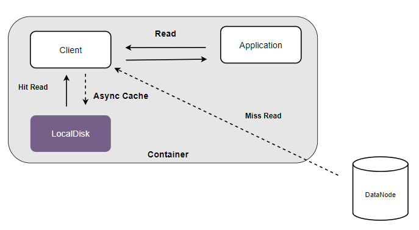

# Local Cache 
Local cache speeds up file access for local processes. In AI training, frequently accessed data such as mini-batches or config files can be stored locally to avoid repeated remote fetches and improve performance.

## Local Cache - Disk
Using the local disk of the computing node as a data block cache can significantly improve the efficiency of data reading.

The read requests from the client will first access the data cache area of the local disk. If the cache is hit, the required data will be obtained directly from the local disk. Otherwise, the data will be read from the backend replicaction subsystem or erasure coding subsystem, and the cached data will be asynchronously written to the local disk to improve the access performance of subsequent requests.



To enable local disk caching, you need to start the local cache service first.

``` bash
./cfs-bcache -c bcache.json
```

Here is a table describing the meanings of various parameters in the configuration file:

| Parameter           | Type           | Meaning                                   | Required  |
|--------------|--------------|--------------------------------------|-----|
| cacheDir         | string       | Local storage path for cached data: allocated space (in bytes)| Yes   |
| logDir       | string       | Path for log files| Yes   |
| logLevel      | string slice | Log levels| Yes   |

Then you just need to add the "bcacheDir" item in the client's configuration file:
``` bash
{
  ...
  "bcacheDir": "path/to/data"  //paths of the directories that you want to cache locally.
}
```

### Cache consistency

CubeFS ensures the eventual consistency of local cache through the following strategies.

+ Disable cache based on file extension: For example, checkpoint files generated during training tasks will be repeatedly updated during task execution, so it is not recommended to do local caching for them. You can disable caching for such files by adding "pt" to "bcacheFilterFiles" in the client's configuration file.
``` bash
{
  ...
  "bcacheFilterFiles": "pt"  //disable caching for files with the ".pt" extension
}
```
+ Periodic check：The client periodically compares the metadata of cached data to detect any changes and removes the local cache data if there are any modifications. 
+ Proactively invalidating. In the scenario of a single mount point, after the user updates the data, the local cache data will be deleted; while in the scenario of multiple mount points, other mount points can only wait for the cache data to expire after the lifecycle expires.

## Local Cache - Memory
If the amount of data is small and you want to further improve the read cache latency, you can use the memory of the compute node as local cache.


`/dev/shm` is a Linux shared memory filesystem that supports dynamically adjusting its capacity size. Here, we will adjust `/dev/shm` to 15GB, indicating that up to 15GB of memory can be used to cache data.
``` bash
$ sudo mount -o size=15360M -o remount /dev/shm
```
Then you can set the "cacheDir" item in the configuration file of the `bache` service to a subdirectory of `/dev/shm`. For reference:
``` bash
{
  ...
  "cacheDir":"/dev/shm/cubefs-cache:16106127360" //Using 15GB of memory as the data cache.
}
```
