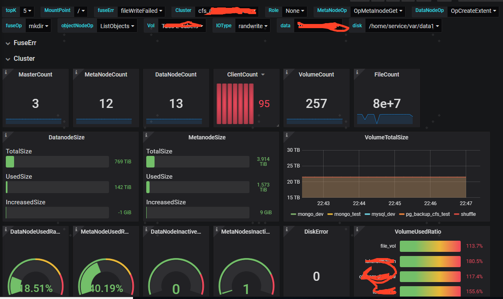

# Visualization Configuration
## Grafana Configuration Template

::: tip Note
The monitoring metrics template of the erasure coding subsystem is not included in the corresponding configuration module example yet, and will be improved later.
:::

+ You can use Grafana to display monitoring data, as shown in the figure below
  + Refer to the *.json files in docker/monitor/grafana/provisioning/dashboards/ for template configuration


+ You can configure monitoring alarm capabilities through Prometheus Alertmanager, refer to the [alertmanager documentation](https://prometheus.io/docs/alerting/latest/alertmanager/)
+ Related references
  + [Prometheus installation](https://prometheus.io/docs/prometheus/latest/getting_started/)
  + [Consul installation](https://developer.hashicorp.com/consul/docs/install)
  + [Grafana installation](https://grafana.com/docs/grafana/v8.4/getting-started/getting-started/)

## Erasure Coding Subsystem Metrics

You can configure personalized monitoring panels based on the monitoring metrics items introduced earlier, such as the following panel examples.


::: tip Note
- Replace `cluster/cluster_id` with the cluster ID
- The `service` label is the service name, configured in the audit log metrics configuration item.
  :::

**Cluster Physical Space Overview**

```bash
# Writable physical capacity
# Unit: bytes
sum by (item)(blobstore_clusterMgr_space_stat_info{cluster="${cluster_id}",item="FreeSpace",is_leader="true"})

# Used physical capacity
# Unit: bytes
sum by (item)(blobstore_clusterMgr_space_stat_info{cluster="${cluster_id}",item="UsedSpace",is_leader="true"})

# Writable logical capacity
# Unit: bytes
sum by (item)(blobstore_clusterMgr_space_stat_info{cluster="${cluster_id}1",item="UsedSpace",is_leader="true"})
```

**Volume Overview**

```bash
# Unit: count
sum by (status) (blobstore_clusterMgr_vol_status_vol_count{cluster="${cluster_id}",is_leader="true"})
```

**SLA**

```bash
((sum by (service)(rate(service_response_code{service="ACCESS",code=~"4..|3..|2..|1.."}[5m]))>0)/(sum by (service)(rate(service_response_code{service="ACCESS"}[5m]))>0))*100
```

**Upload Bandwidth**

```bash
# Unit: bits/sec
sum by (idc) (rate(service_request_length{service="ACCESS",api=~"access.put|access.putat"}[5m]))*8
```

**Download Bandwidth**

```bash
# Unit: bits/sec
sum by (idc) (rate(service_response_length{service="ACCESS",api=~"access.get"}[5m]))*8
```

**Five-Minute Request Exceptions**

```bash
# Unit: count
sum by (api,service,code)(increase(service_response_code{code!~"200|206|404|700|702|621|622|651|654|923"}[5m]))>0
```

**Request QPS**

```bash
# Unit: count
sum by (service,idc,api)(rate(service_response_code{}[5m]))
```

**Average Upload Latency**

```bash
# Unit: ms
(histogram_quantile(0.95, sum by(idc,le) (rate(service_response_duration_ms_bucket{code=~"2..",service="ACCESS",api=~"access.put|access.putat"}[5m]))))>0
```

**Average Download Latency**

```bash
# Unit: ms
(histogram_quantile(0.95, sum by(idc,le) (rate(service_response_duration_ms_bucket{code=~"2..",service="ACCESS",api=~"access.get"}[5m]))))>0
```

**Average Deletion Latency**

```bash
# Unit: ms
histogram_quantile(0.95, sum by(idc,le) (rate(service_response_duration_ms_bucket{code=~"2..",service="ACCESS",api="access.delete"}[5m])))>0
```

**Proxy Codemode Overview**

```bash
# Unit: count
sum by(idc,codemode) (blobstore_proxy_volume_status{cluster="${cluster_id}",type="total_free_size"})
```

**Background Migration Rate**

```bash
# Unit: bits/sec
sum by (task_type) (rate(scheduler_task_data_size{cluster_id="${cluster_id}"}[5m]))*8
```

**Shard Migration Count**

```bash
# Unit: count
sum by (task_type) (rate(scheduler_task_shard_cnt{cluster_id="${cluster_id}"}[5m]))
```

**Task Cancellation or Redistribution Count**

```bash
# Unit: count
sum (increase(scheduler_task_reclaim{cluster_id="${cluster_id}"}[5m])) by (task_type)
sum (increase(scheduler_task_cancel{cluster_id="${cluster_id}"}[5m])) by (task_type)
```

**Background Task Count**

```bash
# Unit: count
sum by (task_type,task_status) (scheduler_task_cnt{cluster_id="${cluster_id}"})
```

**Repair Message Consumption Latency**

```bash
# Note: Replace the topic with the corresponding repair message topic
min by (cluster_id,topic,partition)(kafka_topic_partition_consume_lag{cluster_id="${cluster_id}",topic=~".*.shard_repair.*|shard.*",module_name="SCHEDULER"})
```

**Deletion Message Consumption Latency**

```bash
# Note: Replace the topic with the corresponding deletion message topic
min by (cluster_id,topic,partition)(kafka_topic_partition_consume_lag{cluster_id="${cluster_id}",topic=~"blob_delete.*|.*.blob_delete.*",module_name="SCHEDULER"})
```

**Free Chunk Distribution**

```bash
sum(increase(scheduler_free_chunk_cnt_range_bucket{}[1m])) by(le)>0
```