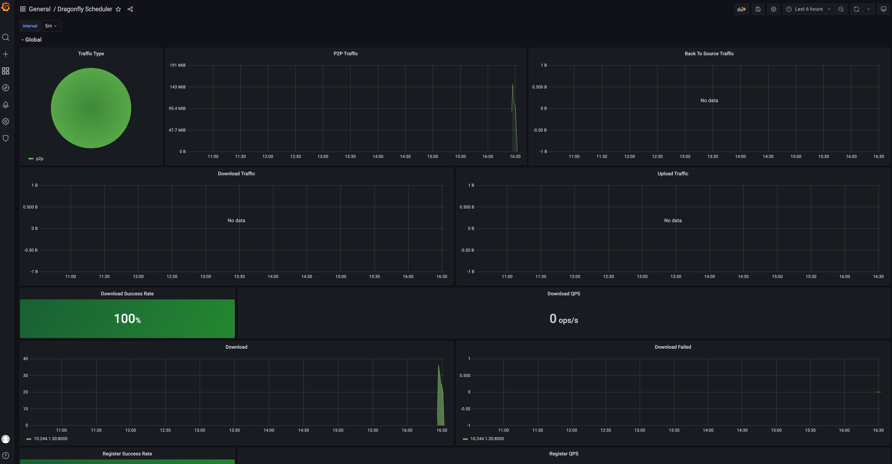
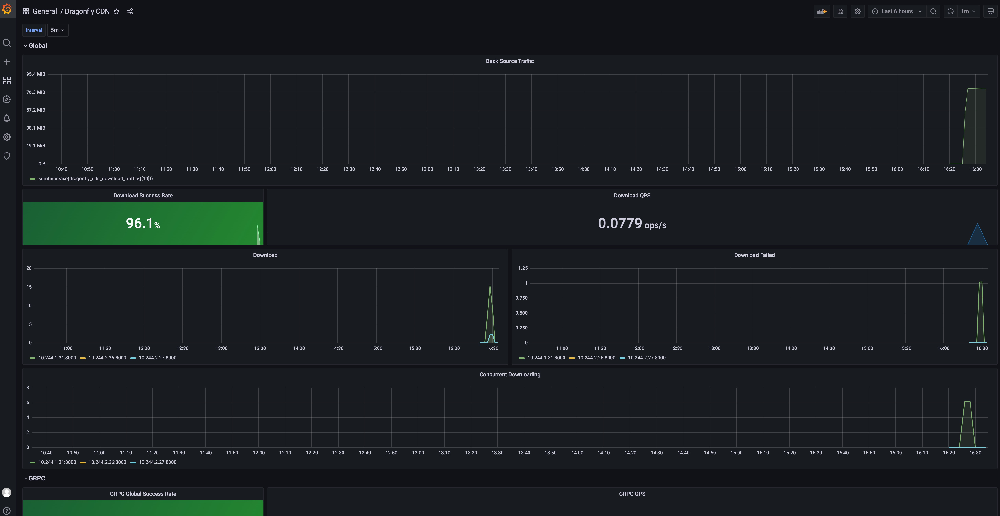

Dragonfly is recommending to use [prometheus](https://prometheus.io/) for monitoring.
Prometheus and grafana configurations are maintained in the
[dragonflyoss/monitoring](https://github.com/dragonflyoss/monitoring/) repository.

Grafana dashboards are published in [grafana.com](https://grafana.com/),
and the address of the dashboards are [Manager](https://grafana.com/grafana/dashboards/15945/),
[Scheduler](https://grafana.com/grafana/dashboards/15944/) and
[CDN](https://grafana.com/grafana/dashboards/15946/).

The following dragonfly monitoring example is based on [kubernetes](https://kubernetes.io/), and uses the
[prometheus-community/kube-prometheus-stack](https://artifacthub.io/packages/helm/prometheus-community/kube-prometheus-stack/)
charts to deploy prometheus and grafana.

## Step 1: Install prometheus and grafana {#step-1-install-prometheus-and-grafana}

Install prometheus and grafana based on [kube-prometheus-stack](https://artifacthub.io/packages/helm/prometheus-community/kube-prometheus-stack)

- Get Repo Info

```bash
helm repo add prometheus-community https://prometheus-community.github.io/helm-charts
helm repo update
```

- Install kube-prometheus-stack charts

```bash
helm install prometheus prometheus-community/kube-prometheus-stack -f https://raw.githubusercontent.com/dragonflyoss/monitoring/main/prometheus/values.yaml
```

- Expose the grafana port at address `localhost:8080`

```bash
kubectl port-forward svc/prometheus-grafana 8080:80
```

- Visit address `localhost:8080` to see the grafana dashboard. You can login with username `admin` and password `prom-operator`


## Step 2: Install dragonfly with ServiceMonitor {#step-2-install-dragonfly-with-servicemonitor}

Install dragonfly based on [dragonfly](https://artifacthub.io/packages/helm/dragonfly/dragonfly).

- Get Repo Info

```bash
helm repo add dragonfly https://dragonflyoss.github.io/helm-charts/
helm repo update
```

- Configure dragonfly charts with `ServiceMonitor`, refer to
  [serviceMonitor](https://github.com/dragonflyoss/helm-charts/blob/main/charts/dragonfly/values.yaml#L256) in chart values.
  Generate dragonfly charts configuration `values.yaml` is as follows:

```yaml
scheduler:
  image: d7yio/scheduler
  tag: latest
  metrics:
    enable: true
    serviceMonitor:
      enable: true

cdn:
  image: d7yio/cdn
  tag: latest
  metrics:
    enable: true
    serviceMonitor:
      enable: true

dfdaemon:
  image: d7yio/dfdaemon
  tag: latest

manager:
  image: d7yio/manager
  tag: latest
  metrics:
    enable: true
    serviceMonitor:
      enable: true
```

- Install dragonfly charts with `ServiceMonitor`

```bash
helm install --create-namespace --namespace dragonfly-system dragonfly dragonfly/dragonfly -f values.yaml
```

## Step 3: Validate metrics {#step-3-validate-metrics}

Visit grafana explore page at `localhost:8080/explore` and
query `dragonfly_manager_requests_total` to validate that dragonfly metrics have been collected.


## Step 4: Import dragonfly grafana dashboards {#step-4-import-dragonfly-grafana-dashboards}

Dragonfly grafana dashboard info is:

<!-- markdownlint-disable -->

| Name                | ID    | Link                                         | Description                                |
| :------------------ | :---- | :------------------------------------------- | :----------------------------------------- |
| Dragonfly Manager   | 15945 | https://grafana.com/grafana/dashboards/15945 | Granafa dashboard for dragonfly manager.   |
| Dragonfly Scheduler | 15944 | https://grafana.com/grafana/dashboards/15944 | Granafa dashboard for dragonfly scheduler. |
| Dragonfly CDN       | 15946 | https://grafana.com/grafana/dashboards/15946 | Granafa dashboard for dragonfly cdn.       |

<!-- markdownlint-restore -->

- Import dragonfly grafana dashboard using ID, IDs are `15945`, `15944` and `15946`, refer to [export-import](https://grafana.com/docs/grafana/latest/dashboards/export-import/)


- Import dragonfly grafana dashboard successfully, you can visit the dashboard





