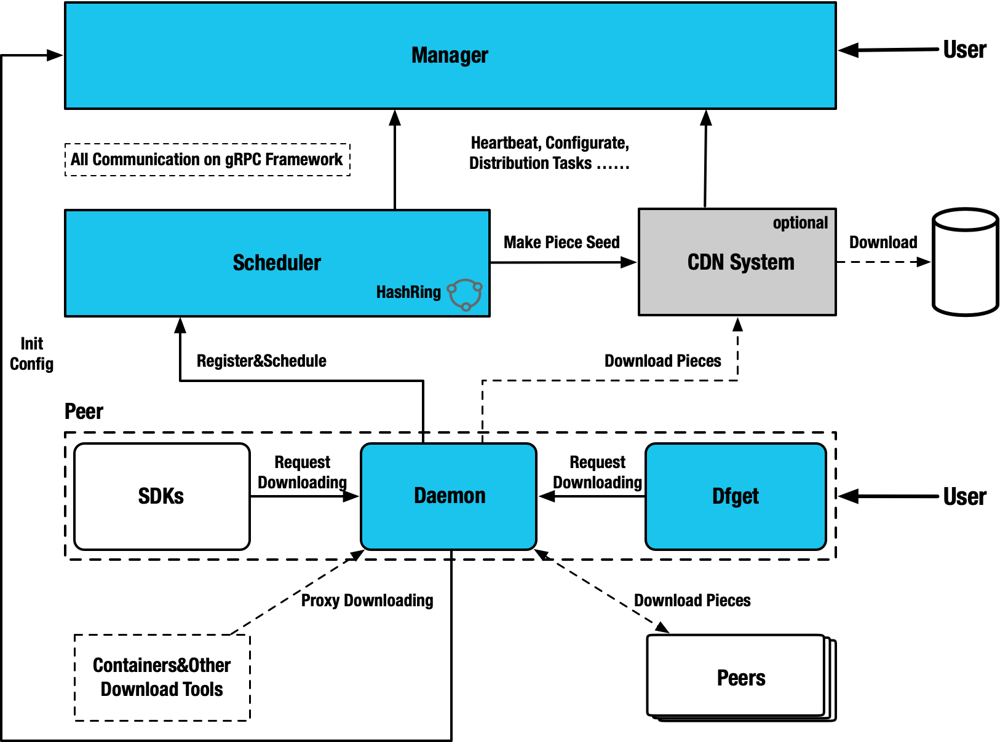

## Positioning {#positioning}

Provide enterprise-level (efficient, stable, secure, low-cost, product-oriented)
file distribution and management services,
and become the cloud-native best practice and standard solution in this realm.

## What problems are solved {#what-problems-are-solved}

**Architecture design flaws:** The existing architecture is difficult to
meet the growing business needs of file distribution,
and has gradually exposed deficiencies in stability,
efficiency, and security, and is facing more and more challenges

**Insufficient value penetration:** Currently only supports HTTP back-to-source protocol,
and lacks adaptation to other types of
storage (HDFS, storage services of various cloud vendors, Maven, YUM, etc.)

**Single distribution mode:** Currently only supports active pull mode,
lack of active push and active synchronization capabilities

**Lack of product capabilities:** No well-experienced console
functions are capabilities, such as distribution task management and control,
data market, multi-tenancy, and permission control, etc.

## Features {#features}

- Through a unified back-to-source adaptation layer and
  realization of P2P file distribution capabilities that
  support various types of storage (HDFS,
  storage services of various cloud vendors, Maven, YUM, etc.)
- Support more distribution modes: active pull, active push,
  real-time synchronization, remote copy, automatic warm-up,
  cross-cloud transmission, etc.
- Separation and decoupling between systems, scheduling and CDN plug-in,
  and support on-demand deployment, light or heavy,
  internal or external, flexible to
  meet the actual needs of different scenarios
- Based on the newly designed P2P protocol framework of grpc,
  with better efficiency and stability
- Support encrypted transmission, account-based transmission
  authentication and current limiting, and multi-tenant isolation mechanism
- Support more efficient IO methods: multi-threaded IO, memory mapping, DMA, etc.
- Support dynamic compression, memory file system and
  more efficient scheduling algorithms to improve distribution efficiency
- The client supports third-party software's native integration
  of Dragonfly's P2P capabilities through the C/S mode
- Production capabilities: support file upload, task management of
  various distribution modes, data views, and global management and control functions
- One set of internal and external, core features are
  shared with each other, and non-common features are extended separately
- Further integration with the ecosystem: Harbor, Nydus
  (image downloading solution on demand),
  warehouse services of various cloud vendors, etc.

## Architecture {#architecture}

## Subsystem features {#subsystem-features}

### Manager {#manager}

- Dynamic configuration management
- Data Big Disk & Bandwidth Measurement
- File upload & distribution management and control
- File synchronization management
- Account & access control
- Subscription & notification
- Multi-tenant management
- Command channel service (channel integration)

### Scheduler {#scheduler}

- Multi-dimensional P2P scheduling strategy
- Intelligent scheduling algorithm (advanced)
- The scheduling results can be quantitatively compared and support A/B Testing
- Scheduling strategy plug-in and CDN subsystem plug-in
- Meta-information distribution pipeline
- Client download results and back-to-source results statistics and
  docking with monitoring services

### CDN {#cdn}

- Multi-source adaptation capabilities, including catalog download
  and range download functions
- DMA read and write
- Transfer back to the source
- Distribute warm-up
- Dynamic compression
- Storage management (seed storage, disk cleaning, block-level storage)
- Memory file system
- Secure transmission (symmetric encryption, integrity check, etc.)
- Storage media plug-in

### dfdaemon {#dfdaemon}

- Multi-source adaptation capabilities, including catalog
  download and range download functions
- Efficient IO mechanism
- IO scheduling of multiple download tasks (high IO throughput)
- Reduce the number of file reads and writes: improve
  the storage of temporary files and improve file integrity verification
- DMA read and write
- Streaming
- Client download Proxy capability (http & https)
- Single service process startup (CS mode) and resident and non-resident modes
- Failed back to source processing
- Local cache capability (client seeder mode)
- Client elegant upgrade and deployment plan
- Command execution

### Framework {#framework}

- High availability, high performance, easy integration
- Consistent Hash algorithm selection
- Client connection management
