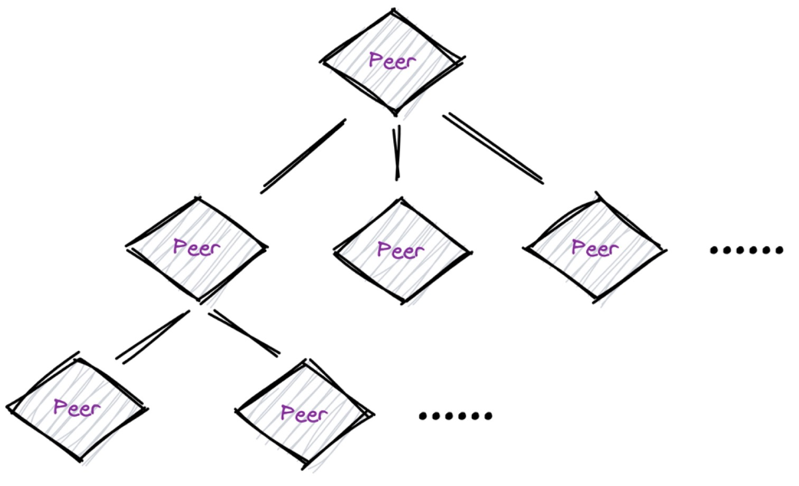

Scheduler selects the optimal parent peer for current peer to be downloaded
and triggers the CDN back-to-source download or dfdaemon back-to-source download at the appropriate time.

## Features {#features}

- Scheduler selects the optimal parent peer
- Build a scheduling tree for the P2P cluster
- Evaluate peers based on different features
- In the case of scheduling failure, let dfdaemon back-to-source download

## Scheduling {#scheduling}

Scheduler maintains task, peer and host resources.

- Peer: a download task for dfdaemon
- Host: host information for dfdaemon, host and peer have a `1:N` relationship
- Task: a download task, task and peer have a `1:N` relationship

The scheduling process is actually to build a tree according to the peer's load.

## Peer State Machine {#peer-state-machine}

The scheduler divides tasks into three types `Tiny`, `Small` and `Normal`.

- Tiny: file size is less than 128 bytes
- Small: only one piece task
- Normal: tasks with more than one piece

Different scheduling strategies are used for different types of download tasks,
following state transition diagram during the peer scheduling process.

