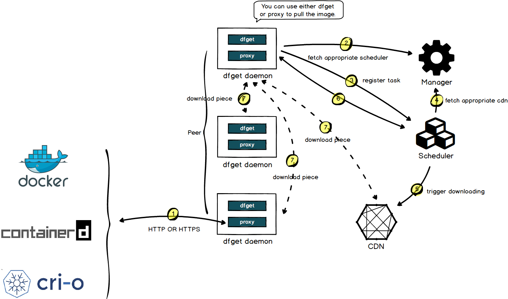

## Introduce {#introduce}

Dragonfly is an open-source p2p-based image and file Distribution System. It is designed to improve the efficiency and
speed of large-scale file distribution. It is widely used in the fields of application distribution,
cache distribution, log distribution and image distribution.

At this stage, Dragonfly has evolved based on [Dragonfly1.x](https://github.com/dragonflyoss/Dragonfly).
On the basis of maintaining the original core capabilities of Dragonfly1.x, Dragonfly
It has been comprehensively upgraded in major features such as system architecture design,
product capabilities, and usage scenarios.

## Features {#features}

Dragonfly provides a one-stop solution for large-scale file distribution. The basic capabilities provided by Dragonfly include:

- **P2P File Distribution**：Use P2P technology for file transfer, improve download efficiency,
  and save bandwidth across IDC.
- **Noninvasive**：Supports multiple containers for distributing images.
- **Host-level speed limit**：Support for host-level limits speed.
- **Consistency**：Make sure all downloaded files are consistent.
- **Isolate abnormal peers**：Automatically isolate abnormal peers to improve download stability.
- **Ecosystem**：Harbor can distribute and preheat images based on the Dragonfly. Image acceleration based on
  Nydus container runtime can use Dragonfly for data distribution.

## Evolution {#evolution}

Dragonfly has been selected and put into production use by many Internet companies since its open source in 2017,
and entered CNCF in October 2018, becoming the third project in China to enter the CNCF Sandbox.
In April 2020, CNCF TOC voted to accept Dragonfly as an CNCF Incubating project.
Dragonfly has developed the next version through production practice,
which has absorbed the advantages of [Dragonfly1.x](https://github.com/dragonflyoss/Dragonfly)
and made a lot of optimizations for known problems.

Dragonfly has unparalleled advantages in large-scale file distribution.
Dragonfly introduces many new features:

**New Architecture**：

Dragonfly is composed of four parts: Manager, Scheduler, Dfdaemon and CDN. The independence of Scheduler and
The decoupling of scheduler and CDN eliminates the mutual influence between scheduling and storage IO.
At the same time, it supports CDN plugin and can be deployed on demand.
In addition, the whole system is based on the GRPC framework
which greatly improves the distribution efficiency of P2P.

**More Application Scenarios**：

Dragonfly supports different types of storage sources, such as HDFS, OSS, NAS, etc.

**Product Capability**：

Dragonfly supports configuration management, data visualization, etc. through the management and control system,
making the system easier to use.

## Architecture {#architecture}

Dragonfly includes four parts Manager, Scheduler, Dfdaemon and CDN, refer to [Architecture](../concepts/terminology/architecture.md).

- **Manager**: Maintain the relationship between each P2P cluster, dynamic configuration management and RBAC.
  It also includes a front-end console, which is convenient for users to visually operate the cluster.
- **Scheduler**: Select the optimal download parent peer for the download peer. Exceptions control Dfdaemon's back-to-source.
- **Dfdaemon**: Based on the C/S architecture, it provides the `dfget` command download tool,
  and the `dfget daemon` running daemon to provide task download capabilities.
- **CDN**: Back-to-source download tasks, cache downloaded data, reduce back-to-source traffic and save bandwidth.
  A CDN is the root peer in a P2P network.

