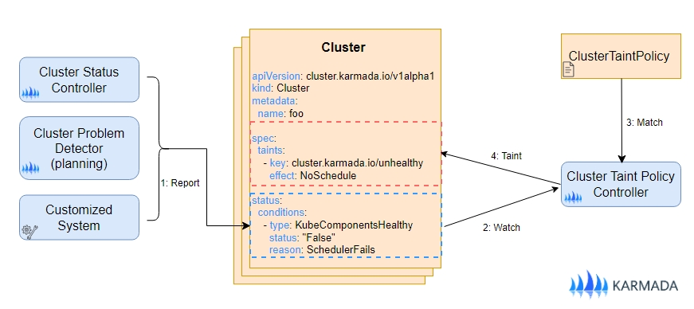

# Karmada v1.14 version released! New Federated ResourceQuota management capabilities!

Karmada is an open multi-cloud and multi-cluster container orchestration engine designed to help users deploy and operate business applications in a multi-cloud environment. With its compatibility with the native Kubernetes API, Karmada can smoothly migrate single-cluster workloads while still maintaining coordination with the surrounding Kubernetes ecosystem tools.

[Karmada v1.14](https://github.com/karmada-io/karmada/releases/tag/v1.14.0) has been released, this version includes the following new features:

- Introduces federated ResourceQuota enforcement capabilities for multi-tenant resource governance scenarios.
- Add customized taint management capabilities to eliminate implicit cluster failure migration.
- Continued improvements in the Karmada Operator.
- Significantly improve the performance of the Karmada controllers.

## Overview of New Features

### Federated ResourceQuota Enhancement

In multi-tenant cloud infrastructures, quota management is crucial for ensuring fair resource allocation and preventing
overuse. Especially in multi-cloud and multi-cluster environments, fragmented quota systems often lead to difficulties
in resource monitoring and management silos. Therefore, implementing cross-cluster federated quota management has become
a key factor in improving resource governance efficiency.

Previously, Karmada allocated global quotas to member clusters via FederatedResourceQuota, with each cluster enforcing
quotas locally. This version enhances federated quota management by introducing control-plane global quota checking mechanism,
enabling direct global resource quota validation at the control plane.

This feature is particularly suitable for:

- Scenarios where you need to track resource consumption and limits from a unified location without worrying about cluster-level allocations.
- Cases where you want to prevent over-submission of tasks by validating quota limits.

Note: This feature is currently in `Alpha` stage and requires enabling the `FederatedQuotaEnforcement` Feature Gate to use.

To set an overall CPU limit of 100, you can define it as follows:

```yaml
apiVersion: policy.karmada.io/v1alpha1
kind: FederatedResourceQuota
metadata:
  name: team-foo
  namespace: team-foo
spec:
  overall:
    cpu: 100
```

Once applied, Karmada will start monitoring and enforcing the CPU resource limit in the test namespace. If you deploy a new Deployment requiring 20 CPUs, the federatedResourceQuota status will update as follows:

```yaml
spec:
  overall:
    cpu: 100
status:
  overall:
    cpu: 100
  overallUsed:
    cpu: 20
```

If your resource request exceeds the 100 CPU limit, the resource will not be scheduled to your member clusters.

For detailed usage of this feature, refer to the feature documentation: [Federated ResourceQuota](https://karmada.io/docs/userguide/bestpractices/federated-resource-quota/).

### Customized Taint Management

In versions prior to v1.14, when users enabled failover, the system would automatically add a NoExecute effect taint to
the cluster upon detecting abnormal health status, triggering migration of all resources on the target cluster.

In this version, we conducted a comprehensive review of potential migration triggers in the system. All implicit cluster
failover behaviors have been eliminated, and explicit constraints for cluster failure mechanisms have been introduced.
This enables unified management of resource migrations triggered by cluster failures, further enhancing system stability
and predictability.

Cluster failure conditions are determined by evaluating the status conditions of faulty cluster objects to apply taints,
a process referred to as "Taint Cluster By Conditions." This version introduces a new API - ClusterTaintPolicy, which
allows users to define custom rules for adding specific taints to target clusters when predefined cluster status conditions
are met.



For more complex cluster failure judgment scenarios, users can directly implement a custom "cluster taint controller" to
control how taints are added or removed from cluster objects.

ClusterTaintPolicy is a cluster-scoped resource. Here's a simple example demonstrating its usage:

```yaml
apiVersion: policy.karmada.io/v1alpha1
kind: ClusterTaintPolicy
metadata:
  name: detect-cluster-notready
spec:
  targetClusters:
    clusterNames:
    - member1
    - member2
  addOnConditions:
  - conditionType: Ready
    operator: NotIn
    statusValues:
    - "True"
  - conditionType: NetworkAvailable
    operator: NotIn
    statusValues:
    - "True"
  removeOnConditions:
  - conditionType: Ready
    operator: In
    statusValues:
    - "True"
  - conditionType: NetworkAvailable
    operator: In
    statusValues:
    - "True"
  taints:
  - key: not-ready
    effect: NoSchedule
  - key: not-ready
    effect: NoExecute
```

The example above describes a ClusterTaintPolicy resource for `member1` and `member2` clusters. When the cluster's status
conditions simultaneously meet Type as `Ready` and `NetworkAvailable` with condition values not equal to True, taints
`{not-ready:NoSchedule}` and `{not-ready:NoExecute}` are added to the target cluster. When the cluster's status conditions
simultaneously meet Type as `Ready` and `NetworkAvailable` with condition values equal to True, the taints `{not-ready:NoSchedule}`
and `{not-ready:NoExecute}` are removed from the target cluster.

For detailed usage of this feature, refer to the feature documentation: [Cluster Taint Management](https://karmada.io/docs/next/userguide/failover/cluster-taint-management/).

### Karmada Operator Continuous Enhancement

This version continues to enhance the Karmada Operator with the following new features:

- Support for configuring Leaf certificate validity periods.
- Support for pausing reconciliation in the Karmada control plane.
- Support for configuring feature gates for the `karmada-webhook` component.
- Support for executing `loadBalancerClass` for the `karmada-apiserver` component to select specific load balancing implementations.
- Introduction of `karmada_build_info` metrics to display build information, along with a set of runtime metrics.

These improvements make the `karmada-operator` more flexible and customizable, enhancing the reliability and stability
of the entire Karmada system.

### Karmada Performance Optimization of the Karmada Controllers

Since the release of v1.13, Karmada adopters have spontaneously organized efforts to optimize Karmada's performance. A
stable and ongoing performance optimization team, `SIG-Scalability`, has now been established, dedicated to improving
Karmada's performance and stability. We thank all participants for their efforts. If you're interested, you're welcome
to join at any time.

In this version, Karmada has achieved significant performance improvements, particularly in the `karmada-controller-manager`
component. To validate these improvements, the following test setup was implemented:

The test setup included 5000 Deployments, each paired with a corresponding PropagationPolicy that scheduled them to two
member clusters. Each Deployment also depended on a unique ConfigMap, which was propagated to the same cluster as the
Deployment. These resources were created while the `karmada-controller-manager` component was offline, meaning Karmada
performed their initial synchronization during the test. The test results are as follows:

- Cold start time (clearing the work queue) was reduced from approximately 7 minutes to about 4 minutes, a 45% improvement.
- Resource detector: Maximum average processing time decreased from 391 ms to 180 ms (54% improvement).
- Dependency distributor: Maximum average processing time decreased from 378 ms to 216 ms (43% improvement).
- Execution controller: Maximum average processing time decreased from 505 ms to 248 ms (50% improvement).

In addition to faster processing speeds, resource consumption was significantly reduced:

- CPU usage decreased from 4-7.5 cores to 1.8-2.4 cores (40%-65% reduction).
- Peak memory usage decreased from 1.9 GB to 1.47 GB (22% reduction).

These results demonstrate that Karmada controller performance has been greatly enhanced in the v1.14 release. Moving
forward, we will continue systematic performance optimizations for controllers and schedulers.

For detailed test reports, refer to [[Performance] Overview of performance improvements for v1.14](https://github.com/karmada-io/karmada/issues/6394).

## Acknowledging Our Contributors

The Karmada v1.14 release includes 271 code commits from 30 contributors. We would like to extend our sincere gratitude to all the contributors:

| ^-^                 | ^-^            | ^-^              |
|---------------------|----------------|------------------|
| @Arhell             | @baiyutang     | @chaosi-zju      |
| @CharlesQQ          | @dongjiang1989 | @everpeace       |
| @husnialhamdani     | @ikaven1024    | @jabellard       |
| @liangyuanpeng      | @likakuli      | @LivingCcj       |
| @liwang0513         | @MdSayemkhan   | @mohamedawnallah |
| @mojojoji           | @mszacillo     | @my-git9         |
| @Pratham-B-Parlecha | @RainbowMango  | @rajsinghtech    |
| @seanlaii           | @tangzhongren  | @tiansuo114      |
| @vie-serendipity    | @warjiang      | @whosefriendA    |
| @XiShanYongYe-Chang | @zach593       | @zhzhuang-zju    |


