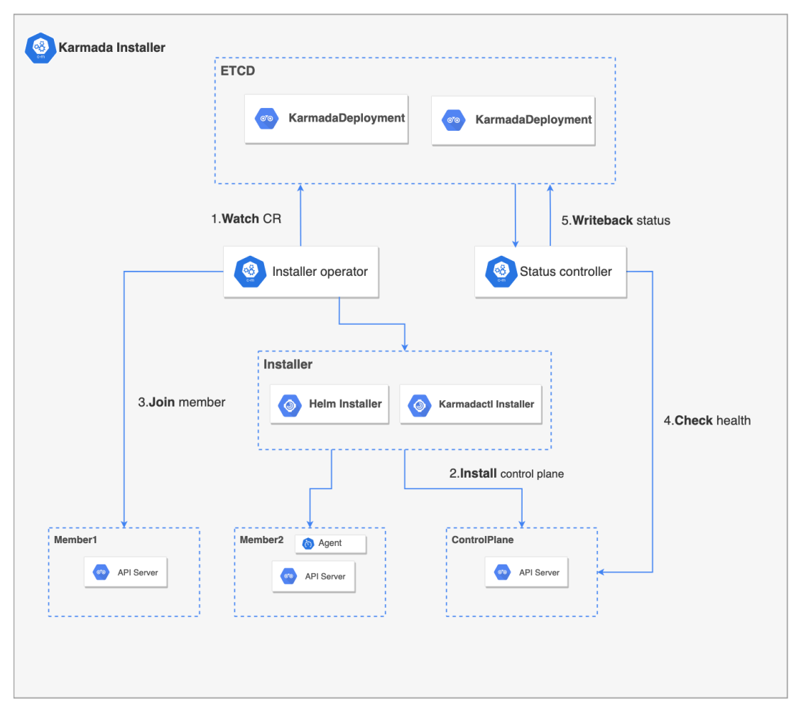

## Challenges and Opportunities

DaoCloud is an innovative leader in the enterprise cloud computing sector. Its product portfolio covers the entire lifecycle of cloud native application development, delivery, operations, and management, providing multiple delivery options such as public cloud, private cloud, and hybrid cloud. According to the CNCF Annual Survey Report of 2022, Kubernetes has become the mainstream cloud computing technology worldwide, with 96% of organizations using or evaluating Kubernetes, and 79% of users adopting certified Kubernetes platforms.
As enterprise cloud adoption continues to grow, multicloud and multi-cluster deployments have gradually become a trend. DaoCloud aims to build an enterprise-grade multicloud platform with **agility, flexibility, scalability, and strong security**, helping its users **reduce management costs caused by fragmented clusters and distributed workloads, enable applications to break cluster boundaries, avoid vendor lock-in, and enhance enterprise risk management**.

## Solution

Before designing its multicloud platform, DaoCloud evaluated multiple solutions from the open-source community, including KubeFed, OCM, Clusternet, and Karmada. After an in-depth comparison, DaoCloud ultimately chose Karmada. The main reasons include:

1. Karmada is compatible with the native Kubernetes API, enabling users to upgrade seamlessly from single-cluster to multi-cluster without modification, while fully integrating with the Kubernetes single-cluster toolchain ecosystem.
2. Karmada is an open and neutral project. The community actively listens to user feedback and welcomes developer contributions.
3. Karmada eliminates vendor lock-in issues in multi-cluster use, supporting automatic distribution and migration of multi-cluster applications without binding to commercial vendor products.
4. Karmada works out of the box, providing built-in policy sets for multiple scenarios.
5. Karmada offers rich multi-cluster scheduling, including affinity-based scheduling and high-availability deployments across multiple granular clusters.
6. Karmada enables centralized management across public cloud, private cloud, and edge clusters without worrying about cluster locations.

## Impact and Benefits

By combining Karmada, DaoCloud created Kairship, an enterprise-level multicloud platform that **enables users to move workloads from on-premises to the cloud, switch seamlessly from single-cloud to multicloud, and focus less on infrastructure differences or adopting new concepts outside of Kubernetes**.

The architecture of Kairship is shown below:

Kairship provides users with the core capabilities natively supported by Karmada:

* Multicloud access control, offering native RBAC-based authentication and authorization.
* Cross-cluster application distribution, supporting differentiated application configurations and distribution based on regions, availability zones, and vendors.
* Distribution and override policies for various multicloud resources such as storage and configuration.
* Cross-cluster failover, providing applications with multicloud high availability.

Thanks to Karmada’s support for the native Kubernetes API, Kairship leverages open-source projects from the Kubernetes toolchain ecosystem to deliver more advanced capabilities.

With Karmada’s high flexibility and scalability, Kairship extends and enhances its functions to meet enterprise requirements, broadening Karmada’s application scenarios.

### Karmada Multi-Instance Requirements

During Karmada’s adoption in real-world scenarios, users expressed a need for multi-instance deployments. One reason is that user environments often require multiple Karmada instances. Another is that multi-instance deployment allows quick one-click onboarding of clusters while abstracting away underlying network configurations.

DaoCloud developed its own Karmada-Operator. Based on Karmada community Helm charts, it enables quick creation, updating, uninstallation, and maintenance of Karmada instances. It also supports rapid onboarding of member clusters to Karmada instances, collecting cluster overview information into the Karmada control plane via a controller.

### Multicloud Access Control

For any enterprise-grade multicloud platform, access control is unavoidable. For Karmada, two new challenges arise: how to achieve permission isolation during application orchestration, and how to achieve multi-tenancy isolation.
Kairship treats the Karmada Host as a regular cluster within the overall DCE 5.0 (DaoCloud’s container engine product) cluster management system, abstracts key RBAC models, and integrates with the existing multi-tenant center.

In addition, Kairship performs significant secondary development on top of Karmada, adding the Kairship Apiserver component for handling overall API requests and performing API-level permission validation. It also introduces the Kairship Controller Manager to handle logical-layer permission synchronization and validation.

### Best Practices for Enterprise Users

Before adopting Karmada, most users already had a large number of single-cluster applications. They wanted a quick way to elevate these single-cluster applications to multicloud applications and leverage Karmada’s advanced features.
Kairship builds upon the community’s karmadactl prompt command to support one-click migration of deployments and their dependent resources. The corresponding resources automatically create Propagation Policies pointing to the current cluster, which can later be extended by adjusting scheduling strategies through modifications to the Propagation Policy.

Currently, Karmada checks API support lists in member clusters and filters out clusters that do not support distributing certain APIs. This prevents users from distributing the same Kubernetes resource type across clusters with different API versions. Kairship solves this by automatically converting Kubernetes resources to match supported API versions in different clusters, enabling version-adaptive application distribution.

Kairship also provides a visual interface for Karmada, allowing users to leverage Karmada’s capabilities more simply and efficiently.

## Conclusion

“Karmada is an open-source, open project dedicated to seamlessly integrating Karmada-based multicloud solutions into the cloud native ecosystem, offering enterprises a smooth evolution path from single-cluster to multicloud architectures. Thanks to the continuous growth of the Karmada community, DaoCloud has been able to contribute back while building enterprise-grade products. In the future, we will continue to participate in contributions across various areas, co-developing and co-governing with the community.”

— Zhang Xiao, Head of the Large Container Team, DaoCloud
