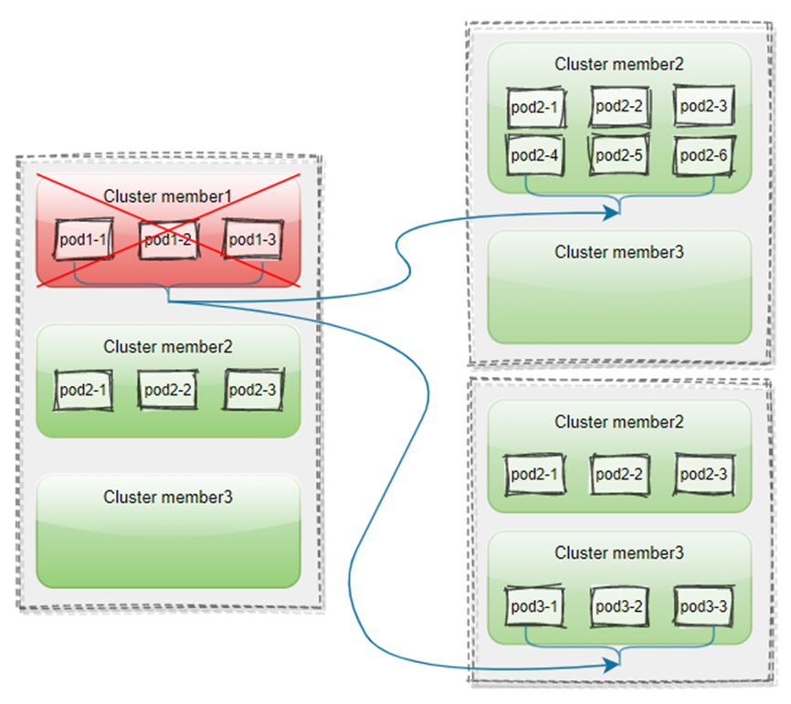
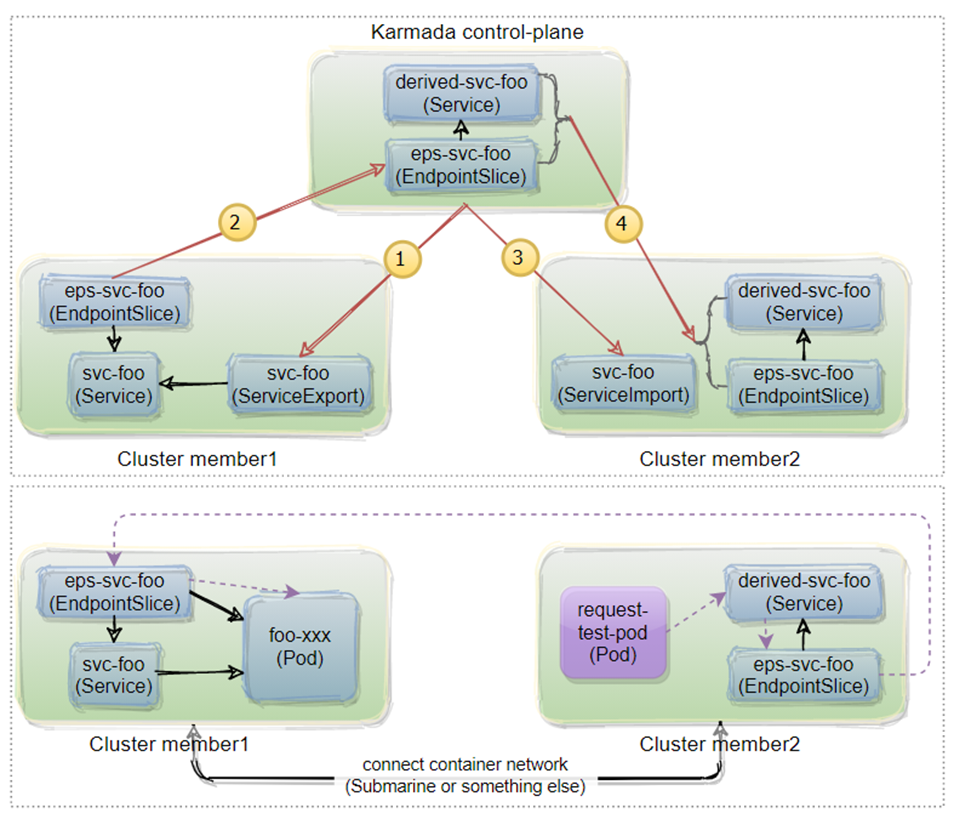

## 跨云多集群多模式管理

Karmada 支持：

* 安全隔离：
  * 为每个集群创建一个 namespace，以`karmada-es-`为前缀。
* [多模式](../userguide/clustermanager/cluster-registration.md) ：
  * Push：Karmada 与成员集群的 kube-apiserver 直连。
  * Pull：在成员集群中装 agent 组件，Karmada 委托任务给 agent 组件。
* 多云支持（符合 Kubernetes 规范）
  * 支持各公有云厂商。
  * 支持私有云。
  * 支持自建集群。
  
成员集群和控制面的整体关系如下图所示：

## 多策略的多集群调度

Karmada 支持：

* 不同 [调度策略](../userguide/scheduling/resource-propagating.md) 下的集群分发能力：
  * ClusterAffinity：基于 ClusterName、Label、Field 的定向调度。
  * Toleration：基于 Taint 和 Toleration 的调度。
  * SpreadConstraint：基于集群拓扑的调度。
  * ReplicasScheduling：针对有实例的工作负载的复制模式与拆分模式。
* 差异化配置（ [OverridePolicy](../userguide/scheduling/override-policy.md) ）：
  * ImageOverrider：镜像的差异化配置。
  * ArgsOverrider：运行参数的差异化配置。
  * CommandOverrider：运行命令的差异化配置。
  * PlainText：自定义的差异化配置。
* 支持 [重调度](../userguide/scheduling/descheduler.md) ：
  * Descheduler（karmada-descheduler）：根据成员集群内实例状态变化触发重调度。
  * Scheduler-estimator(karmada-scheduler-estimator)：为调度器提供更精确的成员集群运行实例的期望状态。

像 k8s 调度一样，Karmada 支持不同的调度策略。整体的调度流程如下图所示：

如果一个成员集群没有足够的资源容纳其中的 Pod，Karmada 会重新调度 Pod。整体的重调度流程如下图所示：

## 应用的跨集群故障迁移

Karmada 支持：

* [集群故障迁移](../userguide/failover/cluster-failover.md) ：
  * Karmada 支持用户设置分发策略，在集群发生故障后，将故障集群实例进行自动的集中式或分散式的迁移。
* 集群污点设置：
  * 当用户为集群设置污点，且资源分发策略无法容忍污点时，Karmada 也会自动触发集群实例的迁移。
* 服务不断服：
  * 在实例迁移过程中，Karmada 能够保证服务实例不跌零，从而确保服务不会断服。

Karmada 支持成员集群的故障迁移，一个成员集群故障会导致集群实例的迁移，如下图所示：

## 全局统一资源视图

Karmada 支持：

* [资源状态收集与聚合](../userguide/globalview/customizing-resource-interpreter.md) ：借助资源解释器（Resource Interpreter），将状态收集并聚合到资源模板
  * 用户自定义，触发 Webhook 远程调用。
  * 对于一些常见资源，在 Karmada 中固定编码。
* [统一资源管理](../userguide/globalview/aggregated-api-endpoint.md) ：统一管理资源的创建、更新、删除、查询。
* [统一运维](../userguide/globalview/proxy-global-resource.md) ：可以在同一个 k8s 上下文中执行`describe`、`exec`、`logs`。
* [资源、事件全局搜索](../tutorials/karmada-search.md) ：
  * 缓存查询：支持全局模糊搜索、全局精确搜索。
  * 第三方存储：支持搜索引擎（Elasticsearch 或 OpenSearch）、关系型数据库、图数据库。

用户可以通过 karmada-apiserver 连接和操作所有成员集群：

用户也可以通过 karmada-apiserver 检查和搜索所有成员集群的资源：

## 最佳生产实践

Karmada 支持：

* [统一认证鉴权](../userguide/bestpractices/unified-auth.md) ：
  * 聚合 API 统一访问入口。
  * 访问权限控制与成员集群一致。
* 全局资源配额（`FederatedResourceQuota`）：
  * 全局配置各成员集群的 ResourceQuota。
  * 配置联邦级别的 ResourceQuota。
  * 实时收集各成员集群的资源使用量。
* 可复用调度策略：
  * 资源模板与调度策略解耦，即插即用。

用户可以通过统一认证连接所有成员集群：

用户也可以通过`FederatedResourceQuota`定义全局资源配额：

## 跨集群服务治理

Karmada 支持：

* [多集群服务发现](../userguide/service/multi-cluster-service.md) ：
  * 使用 ServiceExport 和 ServiceImport，实现跨集群的服务发现。
* [多集群网络支持](../userguide/network/working-with-submariner.md) ：
  * 使用`Submariner`打通集群间容器网络。
* [使用 ErieCanal 实现跨集群的服务治理](../userguide/service/working-with-eriecanal.md)
  * 与 `ErieCanal` 集成支持跨集群的服务治理。

用户可以使用 Karmada，开启跨集群服务治理：

