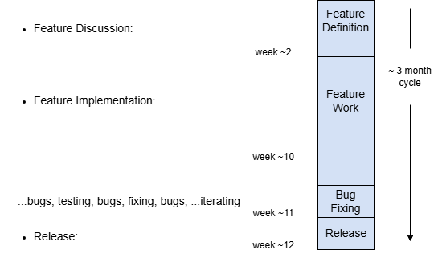
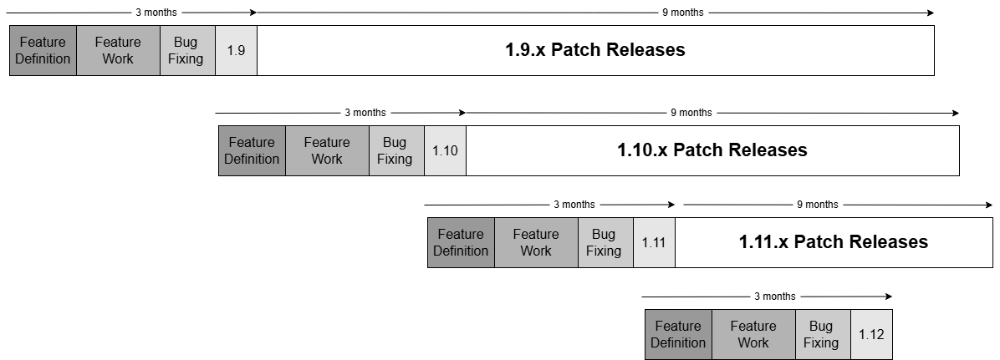

## Release Notes and Assets

Release notes are available on GitHub at https://github.com/karmada-io/karmada/releases.

## Release Management

This section provides guidelines on release timelines and release branch maintenance.

### Release Timelines

Karmada uses the Semantic Versioning schema. Karmada v1.0.0 was released in December 2021. This project follows a given version number MAJOR.MINOR.PATCH.

### MAJOR release

Major releases contain large features, design and architectural changes, and may include incompatible API changes. Major releases are low frequency and stable over a long period of time.

### MINOR release

Minor releases contain features, enhancements, and fixes that are introduced in a backwards-compatible manner. Since Karmada is a fast growing project and features continue to iterate rapidly, having a minor release approximately every few months helps balance speed and stability.

* Roughly every 3 months

### PATCH release

Patch releases are for backwards-compatible bug fixes and very minor enhancements which do not impact stability or compatibility. Typically only critical fixes are selected for patch releases. Usually there will be at least one patch release in a minor release cycle.

* When critical fixes are required, or roughly each month

### Versioning

Karmada uses GitHub tags to manage versions. New releases and release candidates are published using the wildcard tag`v<major>.<minor>.<patch>`.

Whenever a PR is merged into the master branch, CI will pull the latest code, generate an image and upload it to the mirror repository. The latest image of Karmada components can usually be downloaded online using the latest tag.
Whenever a release is released, the image will also be released, and the tag is the same as the tag of the release above.

### Issues

Non-critical issues and features are always added to the next minor release milestone, by default.

Critical issues, with no work-arounds, are added to the next patch release.

### Branches and PRs

Release branches and PRs are managed as follows:

* All changes are always first committed to `master`.
* Branches are created for each major or minor release.
* The branch name will contain the version, for example release-1.2.
* Patch releases are created from a release branch.
* For critical fixes that need to be included in a patch release, PRs should always be first merged to master and then cherry-picked to the release branch. PRs need to be guaranteed to have a release note written and these descriptions will be reflected in the next patch release.
  The cherry-pick process of PRs is executed through the script. See usage [here](https://karmada.io/docs/contributor/cherry-picks).
* For complex changes, specially critical bugfixes, separate PRs may be required for master and release branches.
* The milestone mark (for example v1.4) will be added to PRs which means changes in PRs are one of the contents of the corresponding release.
* During PR review, the Assignee selection is used to indicate the reviewer.

### Release Planning

A minor release will contain a mix of features, enhancements, and bug fixes.

Major features follow the Karmada Design Proposal process. You can refer to [here](https://github.com/karmada-io/karmada/tree/master/docs/proposals/resource-interpreter-webhook) as a proposal example.

During the start of a release, there may be many issues assigned to the release milestone. The priorities for the release are discussed in the bi-weekly community meetings.
As the release progresses several issues may be moved to the next milestone. Hence, if an issue is important it is important to advocate its priority early in [the release cycle](#The Release Cycle).

### Release Artifacts

The Karmada container images are available at `dockerHub`.
You can visit `https://hub.docker.com/r/karmada/<component_name>` to see the details of images.
For example, [here](https://hub.docker.com/r/karmada/karmada-controller-manager) for karmada-controller-manager.

#### Platform Support
**Operating System:**

- Linux
- Darwin

**Architecture:**

- AMD64
- ARM64

#### Artifacts

The following artifacts are uploaded:

* crds.tar.gz
* karmada-chart-v\<version_number\>.tgz
* karmada-chart-v\<version_number\>.tgz.sha256
* karmada-charts.intoto.jsonl
* karmada-cli.intoto.jsonl
* karmada-crds.intoto.jsonl
* karmada-operator-chart-v\<version_number\>.tgz
* karmada-operator-chart-v\<version_number\>.tgz.sha256
* karmada-sbom.intoto.jsonl
* karmadactl-darwin-amd64.tgz
* karmadactl-darwin-amd64.tgz.sha256
* karmadactl-darwin-arm64.tgz
* karmadactl-darwin-arm64.tgz.sha256
* karmadactl-linux-amd64.tgz
* karmadactl-linux-amd64.tgz.sha256
* karmadactl-linux-arm64.tgz
* karmadactl-linux-arm64.tgz.sha256
* kubectl-karmada-darwin-amd64.tgz
* kubectl-karmada-darwin-amd64.tgz.sha256
* kubectl-karmada-darwin-arm64.tgz
* kubectl-karmada-darwin-arm64.tgz.sha256
* kubectl-karmada-linux-amd64.tgz
* kubectl-karmada-linux-amd64.tgz.sha256
* kubectl-karmada-linux-arm64.tgz
* kubectl-karmada-linux-arm64.tgz.sha256
* sbom.tar.gz
* Source code(zip)
* Source code(tar.gz)

You can visit `https://github.com/karmada-io/karmada/releases/download/v<version_number>/<artifact_name>` to download the artifacts above.

For example:

```shell
wget https://github.com/karmada-io/karmada/releases/download/v1.3.0/karmadactl-darwin-amd64.tgz
```

## The Release Cycle



Currently, each karmada release cycle takes about 3 months. The release process can be thought of as having three main phases:

- Enhancement Definition
- Implementation
- Stabilization

But in reality, this is an open source and agile project, with feature planning and implementation happening at all times. 

### Release Timeline

Karmada's releases follow a certain time specification, which facilitates release management and improves version predictability. The detailed release time line is as follows:


In each minor release cycle of Karmada, the tags include `alpha.1`, `alpha.2`, `beta.0`, and `rc.0`. These tags represent important milestones as the release matures. Each phase indicates different levels of stability and feature completeness, ranging from the initial alpha test versions to the near-final release candidate (rc). This structured progression ensures a consistent improvement in software quality.

Notes: 

- All time points are projected and actual releases may vary due to factors such as development progress.
- Important decisions, such as whether to delay a release, will be made by the release team.

### Support Versions
Karmada maintains the three most recent minor releases, meaning that each minor release receives approximately nine months of patch maintenance following its release. However, in exceptional cases where severe issues arise, we may consider releasing patches for earlier versions as well, based on the specific circumstances.

