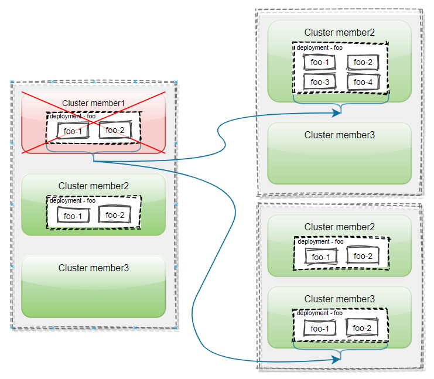

In the multi-cluster scenario, user workloads may be deployed in multiple clusters to improve service high availability. In Karmada, when a cluster fails or the user does not want to continue running workloads on a cluster, the cluster status will be marked as unavailable and some taints will be added. 

After detecting a cluster fault, the taint-manager will evict workloads from the fault cluster. And then the evicted workloads will be scheduled to other clusters that are the best-fit. In this way, the fail-over is achieved, and this ensures the high availability and continuity of user services. 

## Why Failover Is Required

The following describes some scenarios of multi-cluster failover:

- The administrator deploys an offline application on the Karmada control plane and distributes the Pod instances to multiple clusters. When a cluster becomes faulty, the administrator wants Karmada to migrate Pod instances in the faulty cluster to other clusters that meet proper conditions.
- A common user deploys an online application on a cluster through the Karmada control plane. The application includes database instances, server instances, and configuration files. The application is exposed through the ELB on the control plane. In this case, a cluster is faulty. The customer wants to migrate the entire application to another suitable cluster. During the application migration, ensure that the service is uninterrupted.
- After an administrator upgrades a cluster, the container network and storage devices used as infrastructure in the cluster are changed. The administrator wants to migrate applications in the cluster to another proper cluster before the cluster upgrade. During the migration, services must be continuously provided.
- ......

## How to Perform Failover



The user has joined three clusters in Karmada: `member1`, `member2`, and `member3`. A `Deployment` named `foo`, which has 2 replicas, is deployed on the karmada control-plane. The deployment is distributed to cluster `member1` and `member2` by using `PropagationPolicy`.

When cluster `member1` fails, pod instances on the cluster are evicted and migrated to cluster `member2` or the new cluster `member3`. This different migration behavior can be controlled by the replica scheduling policy `ReplicaSchedulingStrategy` of `PropagationPolicy/ClusterPropagationPolicy`.

## How Do I Enable the Feature?

The failover feature is controlled by the `Failover` feature gate. `Failover` feature gate is disabled by default for now, which should be explicitly enabled to avoid unexpected incidents. You can enable it in the `karmada-controller-manager`:

```
--feature-gates=Failover=true
```

In addition, if the feature `GracefulEviction` is enabled, the eviction will be very smooth, that is, the removal of evicted workloads will be delayed until the workloads are available on new clusters or reach the maximum grace period.

The graceful eviction feature is controlled by the `Failover` and `GracefulEviction` feature gates. `GracefulEviction` feature gate is enabled by default for now. You can enable the `Failover` and `GracefulEviction` feature gates of `karmada-controller-manager`:

```
--feature-gates=Failover=true,GracefulEviction=true
```
