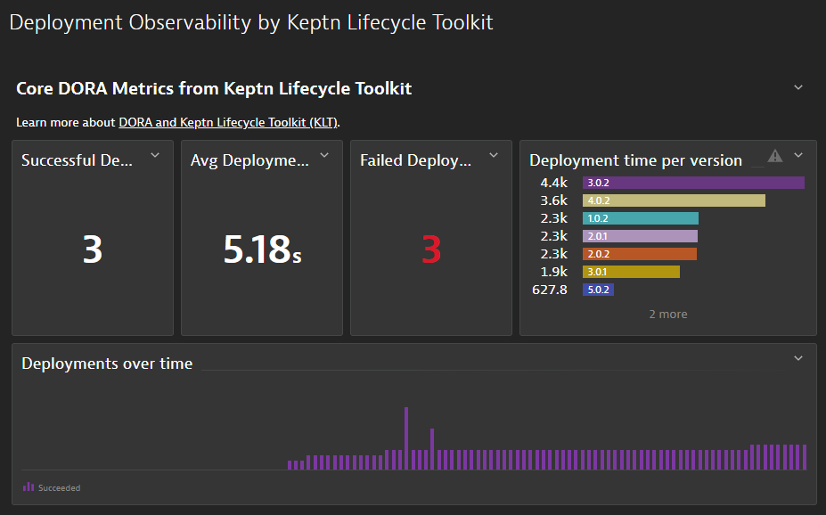

# DORA metrics

DORA metrics are an industry-standard set of measurements
that are included in Keptn;
see the following for a description:

- [What are DORA Metrics and Why Do They Matter?](https://codeclimate.com/blog/dora-metrics)
- [Are you an Elite DevOps Performer?
   Find out with the Four Keys Project](https://cloud.google.com/blog/products/devops-sre/using-the-four-keys-to-measure-your-devops-performance)

DORA metrics provide information such as:

- How many deployments happened in the last six hours?
- Time between deployments
- Deployment time between versions
- Average time between versions.

Keptn starts collecting these metrics
as soon as you apply
[basic annotations](./integrate.md#basic-annotations)
to the
[workload](https://kubernetes.io/docs/concepts/workloads/)
resources
([Deployments](https://kubernetes.io/docs/concepts/workloads/controllers/deployment/),
[StatefulSets](https://kubernetes.io/docs/concepts/workloads/controllers/statefulset/),
[DaemonSets](https://kubernetes.io/docs/concepts/workloads/controllers/daemonset/),
and
[ReplicaSets](https://kubernetes.io/docs/concepts/workloads/controllers/replicaset/)
or
[Pods](https://kubernetes.io/docs/concepts/workloads/pods/)).

Metrics are collected only for the resources that are annotated.

To view DORA metrics, run the following two commands:

- Retrieve the service name with:

```shell
kubectl -n keptn-system get service \
-l control-plane=lifecycle-operator
```

- Then port-forward to the name of your service:

```shell
kubectl -n keptn-system port-forward \
service/<YOURNAME> 2222
```

Then view the metrics at:

```shell
http://localhost:2222/metrics
```

DORA metrics are also displayed on Grafana
or whatever dashboard application you choose.
For example:


