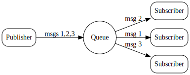

# Queue Groups  
When subscribers register themselves to receive messages from a publisher, the 1:N fan-out pattern of messaging ensures that any message sent by a publisher, reaches all subscribers that have registered. NATS provides an additional feature named "queue", which allows subscribers to register themselves as part of a queue. Subscribers that are part of a queue, form the "queue group".  

## How queue groups function  
As an example, consider message delivery occurring in the 1:N pattern to all subscribers based on the subject name (delivery happens even to subscribers that are not part of a queue group). If a subscriber is registered based on a queue name, it will always receive messages it is subscribed to, based on the subject name. However, if more subscribers are added to the same queue name, they become a queue group, and only one randomly chosen subscriber of the queue group will consume a message each time a message is received by the queue group. Such distributed queues are a built-in load balancing feature that NATS provides.  
  
**Advantages**  
- Ensures application fault tolerance
- Workload processing can be scaled up or down
- No extra configuration required
- Queue groups are defined by the application and their queue subscribers, rather than the server configuration

Queue group names follow the same naming rules as [subjects](../../subjects.md). Foremost, they are case sensitive and cannot contain whitespace. Consider structuring queue groups hierarchically using a period `.`. Some server functionalities can use [wildcard matching](../../subjects.md#wildcards) on them.

Queue subscribers are ideal for scaling services. Scale up is as simple as running another application, scale down is terminating the application with a signal that drains the in flight requests. This flexibility and lack of any configuration changes makes NATS an excellent service communication technology that can work with all platform technologies.

### No responder

When a request is made to a service (request/reply) and the NATS Server knows there are no services available (since there are no client applications currently subscribing to the subject in a queue-group) the server will send a “no-responders” protocol message back to the requesting client which will break from blocking API calls. This allows applications to react immediately. This further enables building a highly responsive system at scale, even in the face of application failures and network partitions.

## Stream as a queue

With [JetStream](../../jetstream/readme.md) a stream can also be used as a queue by setting the retention policy to `WorkQueuePolicy` and leveraging [`pull` consumers](../../jetstream/consumers.md) to get easy horizontal scalability of the processing (or using an explicit ack push consumer with a queue group of subscribers).

### Queuing geo-affinity

When connecting to a globally distributed NATS super-cluster, there is an automatic service geo-affinity due to the fact that a service request message will only be routed to another cluster (i.e. another region) if there are no listeners on the cluster available to handle the request locally.

### Tutorial

Try NATS queue subscriptions on your own, using a live server by walking through the [queueing walkthrough](queues_walkthrough.md).
