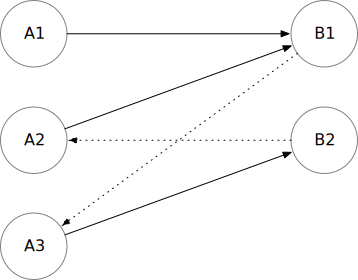
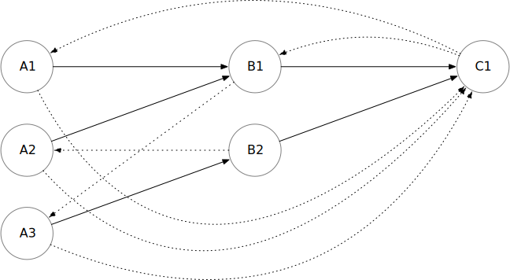

# Super-cluster with Gateways

## Gateways

Gateways enable connecting one or more clusters together into a full mesh; they allow the formation of superclusters from smaller clusters. Cluster and Gateway protocols listen on different ports. Clustering is used for adjacent servers; gateways are for joining clusters together.

Gateway configuration is similar to clustering:

* gateways have a dedicated port where they listen for gateway requests
* gateways gossip gateway nodes and remote discovered gateways

Unlike clusters, gateways:

* have names, specifying the cluster they are in
* don't form a full mesh between gateway nodes, but form a full mesh between cluster instead
* are bound by uni-directional connections
* don't gossip gateway nodes to clients

Gateways exist to:

* reduce the number of connections required between servers 
* optimize the interest graph propagation

If gateways are to be used in a cluster, **all** servers of this cluster need to have a gateway configuration with the **same name**. Furthermore, every gateway node needs to be able to **connect to any** other gateway node and vice versa. Everything else is considered a misconfiguration.

## Gateway Connections

A nats-server in a gateway role will specify a port where it will accept gateway connections. If the configuration specifies other _external_ `gateways`, the gateway will create one outbound gateway connection for each gateway in its configuration. It will also gossip other gateways it knows or discovers. Fewer _external_ `gateways` mean less configuration. Yet, the ability to discover more gateways and gateway nodes depends on these servers running. This is similar to _seed server_ in cluster. It is recommended to have all _seed server_ of a cluster listed in the `gateways` section.

If the local cluster has three gateway nodes, this means there will be three outbound connections from the local cluster to each external gateway cluster.

> In the example above cluster _A_ has configured gateway connections for _B_ \(solid lines\). B has discovered gateway connections to _A_ \(dotted lines\). Note that the number of outgoing connections always matches the number of gateways with the same name.

> In this second example, again configured connections are shown with solid lines and discovered gateway connections are shown using dotted lines. Gateways _A_ and _C_ were both discovered via gossiping; _B_ discovered _A_ and _A_ discovered _C_.

A key point in the description above is that each node in the cluster will make a connection to a single node in every remote cluster — a difference from the clustering protocol, where every node is directly connected to all other nodes.

For those mathematically inclined, cluster connections are `N(N-1)/2` where _N_ is the number of nodes in the cluster. On gateway configurations, outbound connections are the summation of `Ni(M-1)` where Ni is the number of nodes in a gateway _i_, and _M_ is the total number of gateways. Inbound connections are the summation of `U-Ni` where U is the sum of all gateway nodes in all gateways, and N is the number of nodes in a gateway _i_. It works out that both inbound and outbound connection counts are the same.

The number of connections required to join clusters using clustering vs. gateways is apparent very quickly. For 3 clusters, with N nodes:

| Nodes per Cluster | Full Mesh Conns | Gateway Conns |
| ---: | ---: | ---: |
| 1 | 3 | 6 |
| 2 | 15 | 12 |
| 3 | 36 | 18 |
| 4 | 66 | 24 |
| 5 | 105 | 30 |
| 30 | 4005 | 180 |

A cluster section is not needed for gateways, they work with single server as well. Yet, they start to be useful when participating cluster consist of more than one server and they reduce the number of connections.

## Interest Propagation

Messages from clients directly connected to a gateway node will be sent along outgoing gateway connections according to the following three interest propagation mechanisms:

* Optimistic Mode
* Interest-only Mode
* Queue Subscriptions

Local interest permitting, the receiving gateway node sends the messages directly to its subscribing clients as well as server within the cluster.

### Optimistic Mode

When a publisher in _A_ publishes "foo", the _A_ gateway will check if cluster _B_ has registered _no_ interest in "foo". If not, it forwards "foo" to _B_. If upon receiving "foo", _B_ has no subscribers on "foo", _B_ will send a gateway protocol message to _A_ expressing that it has no interest on "foo", preventing future messages on "foo" from being forwarded.

Should a subscriber on _B_ create a subscription to "foo", _B_ knowing that it had previously rejected interest on _foo_, will send a gateway protocol message to cancel its previous _no interest_ on "foo" in _A_.

### Interest-only Mode

When a gateway on _A_ sends many messages on various subjects for which _B_ has no interest. _B_ sends a gateway protocol message for _A_ to stop sending optimistically, and instead send if there's known interest in the subject. As subscriptions come and go on _B_, _B_ will update its subject interest with _A_.

### Queue Subscriptions

When a queue subscriber creates a new subscription, the gateway propagates the subscription interest to other gateways. The subscription interest is only propagated _once_ per _Account_ and subject. When the last queue subscriber is gone, the cluster interest is removed.

Queue subscriptions work on _Interest-only Mode_ to honor NATS' queue semantics across the _Super Cluster_. For each queue group, a message is only delivered to a single queue subscriber. If the same queue group exists in multiple clusters, the server will pick one member from the queue group in its cluster, only sending to a different cluster if there is no interest in its cluster. In other words, a server will always try to serve local queue subscribers first and only failover when a local queue subscriber is not found. The server will pick the cluster with the lowest RTT.

### Gateway Configuration

The [Gateway Configuration](gateway.md) document describes all the options available to gateways.

