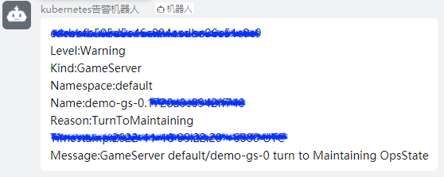

# Service Qualities
## Feature overview

Because a game server is stateful, a game server usually exists in a pod in the form of a rich container, and multiple processes are managed in a pod in a centralized manner.
However, the processes in a pod vary in importance. If an error occurs in a lightweight process, you may not want to delete and recreate the entire pod. Therefore, the native liveness probe feature of Kubernetes does not suit gaming scenarios.
In OpenKruiseGame, the service quality of game servers is defined by game developers. Game developers can set handling actions based on the statuses of game servers. The custom service quality feature is a combination of probing and action. This combination helps automatically deal with various issues related to game server statuses.

## Example

### Set the O&M status of idle game servers to WaitToBeDeleted

Deploy a GameServerSet that contains the custom service quality field.
```shell
cat <<EOF | kubectl apply -f -
apiVersion: game.kruise.io/v1alpha1
kind: GameServerSet
metadata:
  name: minecraft
  namespace: default
spec:
  replicas: 3
  gameServerTemplate:
    spec:
      containers:
        - image: registry.cn-hangzhou.aliyuncs.com/gs-demo/gameserver:idle
          name: minecraft
  updateStrategy:
    rollingUpdate:
      podUpdatePolicy: InPlaceIfPossible
      maxUnavailable: 100%
  serviceQualities: # Set the service quality named idle.
    - name: idle
      containerName: minecraft
      permanent: false
      # Similar to the native probe feature, a script is executed to probe whether a game server is idle, that is, whether no player joins the game server.
      exec:
        command: ["bash", "./idle.sh"]
      serviceQualityAction:
          # If no player joins the game server, the O&M status of the game server is set to WaitToBeDeleted.
        - state: true
          opsState: WaitToBeDeleted
          # If players join the game server, the O&M status of the game server is set to None.
        - state: false
          opsState: None
EOF
```

After the deployment is completed, because no players have joined the game servers, all game servers are idle and their O&M status is WaitToBeDeleted.
```shell
kubectl get gs
NAME          STATE   OPSSTATE          DP    UP
minecraft-0   Ready   WaitToBeDeleted   0     0
minecraft-1   Ready   WaitToBeDeleted   0     0
minecraft-2   Ready   WaitToBeDeleted   0     0
```

When a player accesses the game server minecraft-1, the O&M status of the game server changes to None.
```shell
kubectl get gs
NAME          STATE   OPSSTATE          DP    UP
minecraft-0   Ready   WaitToBeDeleted   0     0
minecraft-1   Ready   None              0     0
minecraft-2   Ready   WaitToBeDeleted   0     0
```

In this case, if game servers are scaled in, game servers other than minecraft-1 are deleted first.

### Set the O&M status of unhealthy game servers to Maintaining

Deploy a GameServerSet that contains the custom service quality field.
```shell
cat <<EOF | kubectl apply -f -
apiVersion: game.kruise.io/v1alpha1
kind: GameServerSet
metadata:
  name: demo-gs
  namespace: default
spec:
  replicas: 3
  gameServerTemplate:
    spec:
      containers:
        - image: registry.cn-hangzhou.aliyuncs.com/gs-demo/gameserver:healthy
          name: minecraft
  updateStrategy:
    rollingUpdate:
      podUpdatePolicy: InPlaceIfPossible
      maxUnavailable: 100%
  serviceQualities: # Set the service quality named healthy.
    - name: idle
      containerName: minecraft
      permanent: false
      # Similar to the native probe feature, a script is executed to probe whether a game server is healthy.
      exec:
        command: ["bash", "./healthy.sh"]
      serviceQualityAction:
          # If the game server is healthy, the O&M status of the game server is set to None.
        - state: true
          opsState: None
          # If the game server is unhealthy, the O&M status of the game server is set to Maintaining.
        - state: false
          opsState: Maintaining
EOF
```

After the deployment is completed, because all the game servers are healthy, the O&M status of all the game servers is None.
```shell
kubectl get gs
NAME        STATE   OPSSTATE   DP    UP
demo-gs-0   Ready   None       0     0
demo-gs-1   Ready   None       0     0
demo-gs-2   Ready   None       0     0
```

Simulate a failure of a process on the game server demo-gs-0. Then, the O&M status of this game server changes to Maintaining.
```shell
kubectl get gs
NAME        STATE   OPSSTATE     DP    UP
demo-gs-0   Ready   Maintaining  0     0
demo-gs-1   Ready   None         0     0
demo-gs-2   Ready   None         0     0
```

In this case, the game server controller sends the event "GameServer demo-gs-0 Warning". You can use the [kube-event project](https://github.com/AliyunContainerService/kube-eventer) to implement exception notification.



In addition, OpenKruiseGame will integrate the tools that are used to automatically troubleshoot and recover game servers in the future to enhance automated O&M capabilities for game servers.