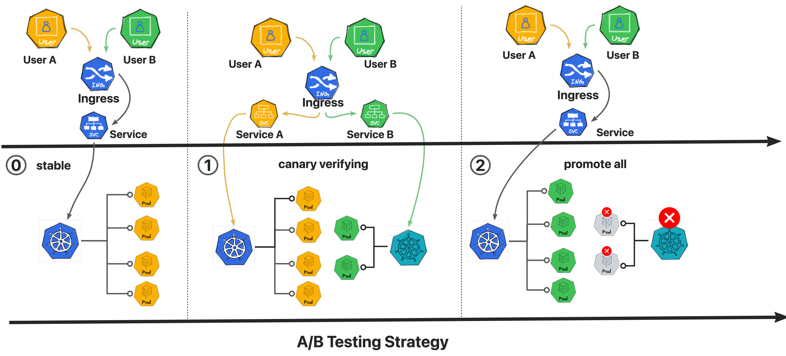

# A/B Testing

## A/B Testing Process
A process of A/B Tesing combing with **canary release**:



## Configuration Example
**Note: Currently, A/B Testing strategy can work on CloneSet, StatefulSet, Advanced StatefulSet, and Deployment.**

In fact, A/B Testing need to combine with canary or multi-batch release strategy, as shown in picture above.

Next we will give an example about **A/B Testing with multi-batch release strategy**:

```YAML
apiVersion: rollouts.kruise.io/v1alpha1
kind: Rollout
metadata:
  name: rollouts-demo
  annotations:
    rollouts.kruise.io/rolling-style: partition
spec:
  objectRef:
    workloadRef:
      apiVersion: apps/v1
      kind: Deployment
      name: workload-demo
  strategy:
    canary:
      steps:
      - replicas: 1
        matches:
        - headers:
          - name: user-agent
            type: Exact
            value: pc
      - replicas: 50%
      - replicas: 100%
    trafficRoutings:
    - service: service-demo
      ingress:
        classType: nginx
        name: ingress-demo
```

### Behavior Explanation

When you apply a new revision for `workload-demo`:
- `1` Pods will be updated in the 1-st batch, the traffic with HTTP header `user-agent=pc` will be guided into new-version Pod, other traffic will be guided into stable-version Pods. Need manual confirmation to next batch.
- `50%` Pods will be updated in the 2-nd batch, the Header matches rule is cancelled, all traffic will obey original load balance rule. Need manual confirmation to next batch.
- `100%` Pods will be updated in the 3-rd batch, the Header matches rule is cancelled, all traffic will obey original load balance rule.
