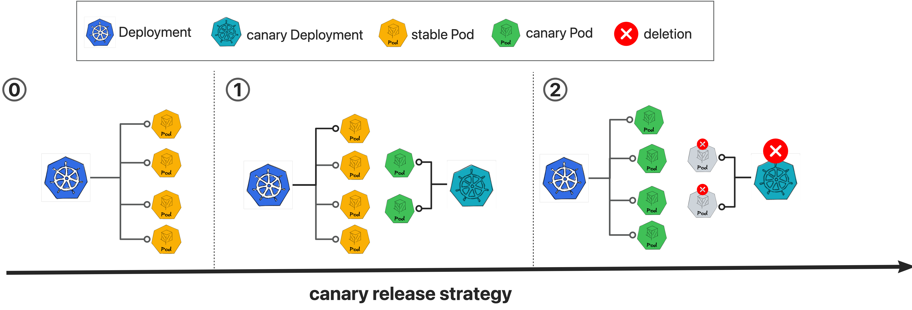

# Canary Release

## Canary Release Process


## Recommended Configuration
**Note: Canary Strategy only works on Deployment.**

```YAML
apiVersion: rollouts.kruise.io/v1alpha1
kind: Rollout
metadata:
  name: rollouts-demo
  annotations:
    rollouts.kruise.io/rolling-style: canary
spec:
  objectRef:
    workloadRef:
      apiVersion: apps/v1
      kind: Deployment
      name: workload-demo
  strategy:
    canary:
      steps:
      - weight: 20
  trafficRoutings:
  - service: service-demo
    ingress:
      classType: nginx
      name: ingress-demo
```

### Behavior Explanation
When you apply a new revision for `workload-demo`:
- The workload `workload-demo` will be paused, and no Pod is updated;
- A new canary Deployment will be created, and its replicas is "20%" of `workload-demo` (There will be `120%` Pods totally);
- `20%` traffic will be guided to the new canary Deployment Pods.

When you thought the verification of canary is ok, and confirmed to next step:
- The workload `workload-demo` will be upgraded using native rolling update strategy;
- The traffic will be restored to native load balance strategy.
- The canary Deployment and Pods will be deleted.
