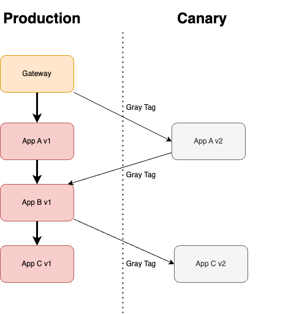

# End to End Canary Release

import Tabs from '@theme/Tabs';
import TabItem from '@theme/TabItem';

## End to End Canary Release Process


End to end canary release is a special kind of canary release. In such canary release, multiple applications in a micro-service system share a common traffic gateway, and the canary replicas of upstream application will pass the traffic to the downstream applications, so that the request will remain in the canary enviroment if available. The end to end canary enviroment is often called traffic swimlane. In such traffic swimlane, requests will go to the replicas of stable version if no canary replicas is available, and go back to canary environment if canary replicas are available again. End to end canary release is often utilized to conduct business evaluation that requires the cooperation of multiple applications.  

The usage of end to end canary release can be illustrated using a simple sample system (gateway -> spring-cloud-a -> spring-cloud-b), that is, the requests will be admited by the gateway, and the gateway will pass the traffic first to `spring-cloud-a`, and `spring-cloud-a` will invoke the downstream `spring-cloud-b`. 

## Common gateway Configuration
Since gateway configuration is shared by multiple applications. The gateway is configured outside of the rollout. 

```YAML

apiVersion: rollouts.kruise.io/v1alpha1
kind: TrafficRouting
metadata:
  name: mse-traffic
spec:
  objectRef:
  - service: spring-cloud-a
    ingress:
      classType: mse
      name: spring-cloud-a
  strategy:
    matches:
   # optional A/B Testing setting
    - headers:
      - type: Exact
        name: User-Agent
        value: foo
   # gray environment will receive 30% traffic 
   #  weight: 20
    # optional request head modification
    requestHeaderModifier:
      set:
      - name: x-mse-tag
        value: gray
```

## Rollout Configuration
**Note: v1beta1 available from Kruise Rollout v0.5.0.**

Rollout configuration of multiple applications can share the same traffic routing by referring the traffic routing config name using `trafficRoutingRef` field or the `rollouts.kruise.io/trafficrouting` annotation. In addition, the canary replicas can have different configuration with the normal replicas by changing the metadata of canary replicas using patchPodTemplateMetadata field. The service discovery implementation e.g. micro-service engine or service mesh can utilize the metadata information to guide traffic to different downstream applications accordingly.
 
<Tabs>
  <TabItem value="v1beta1" label="v1beta1" default>

```YAML
# a rollout configuration
apiVersion: rollouts.kruise.io/v1beta1
kind: Rollout
metadata:
  name: rollout-a
spec:
  workloadRef:
    apiVersion: apps/v1
    kind: Deployment
    name: spring-cloud-a
  strategy:
    canary:
      steps:
      - pause: {}
        replicas: 1
      patchPodTemplateMetadata:
        labels:
          alicloud.service.tag: gray
          opensergo.io/canary-gray: gray
      trafficRoutingRef: mse-traffic      
---
# b rollout configuration
apiVersion: rollouts.kruise.io/v1beta1
kind: Rollout
metadata:
  name: rollout-b
spec:
  workloadRef:
    apiVersion: apps/v1
    kind: Deployment
    name: spring-cloud-b
  strategy:
    canary:
      steps:
        - pause: {}
          replicas: 1
      patchPodTemplateMetadata:
        labels:
          alicloud.service.tag: gray
          opensergo.io/canary-gray: gray
      trafficRoutingRef: mse-traffic
```
  </TabItem>
  <TabItem value="v1alpha1" label="v1alpha1">

```YAML
# a rollout configuration
apiVersion: rollouts.kruise.io/v1alpha1
kind: Rollout
metadata:
  name: rollout-a
  annotations:
    rollouts.kruise.io/trafficrouting: mse-traffic
spec:
  objectRef:
    workloadRef:
      apiVersion: apps/v1
      kind: Deployment
      name: spring-cloud-a
  strategy:
    canary:
      steps:
      - pause: {}
        replicas: 1
      patchPodTemplateMetadata:
        labels:
          alicloud.service.tag: gray
          opensergo.io/canary-gray: gray
---
# b rollout configuration
apiVersion: rollouts.kruise.io/v1alpha1
kind: Rollout
metadata:
  name: rollout-b
  annotations:
    rollouts.kruise.io/trafficrouting: mse-traffic
spec:
  objectRef:
    workloadRef:
      apiVersion: apps/v1
      kind: Deployment
      name: spring-cloud-b
  strategy:
    canary:
      steps:
        - pause: {}
          replicas: 1
      patchPodTemplateMetadata:
        labels:
          alicloud.service.tag: gray
          opensergo.io/canary-gray: gray
```

  </TabItem>
</Tabs>

### Behavior Explanation
When you apply a new revision for `spring-cloud-a`:
- The native rolling update of workload `spring-cloud-a` will be paused to ensure the stable replicas is still available during the canary release.
- A new canary Deployment will be created with 1 replica, and the replica will have additional labels `alicloud.service.tag: gray` and `opensergo.io/canary-gray: gray`
- Traffic with header `User-Agent=foo` will be routed to the new canary Deployment pod, in addition an extra header `x-mse-tag=gray` is added to help. 
- `spring-cloud-a` will invoke the canary replicas of downstream application spring-cloud-b if available, and will invoke the stable replicas if no canary spring-cloud-b exists. Note that, this step requires the support of service discovery implementation. 

When you thought the verification of canary is ok, and confirmed to next step:
- The workload `spring-cloud-a` will be upgraded using native rolling update strategy;
- The traffic will be restored to native load balance strategy.
- The canary Deployment and Pods will be deleted.
